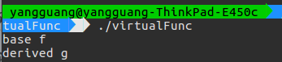
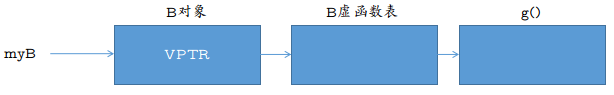

# C++

参考

* C 和 C++ 安全编码

## 虚函数

C++ 中虚函数是用 virtual 关键字声明的类型成员函数

```C
#include <iostream>

class A
{
  public:
    void f(void)
    {
        std::cout << "base f" << std::endl;
    }

    virtual void g(void)
    {
        std::cout << "base g" << std::endl;
    }
};

class B : public A
{
  public:
    void f(void)
    {
        std::cout << "derived f" << std::endl;
    }

    virtual void g(void)
    {
        std::cout << "derived g" << std::endl;
    }
};

int main()
{
    A *myB = new B();
    myB->f();
    myB->g();
}
```

class B 派生自 A

调用 myB->f() 时,与 A 相关联的函数 f() 被调用

调用 myB->g() 时,与 B 相关联的函数 g() 被调用



大多数 C++ 编译器使用虚函数表 VTBL 实现虚函数

VTBL 是一个函数指针数组,用于在运行时派发虚函数调用

每一个对象的头部,都包含一个指向 VTBL 的虚指针 VPTR

VTBL 含有指向虚函数的每一个实现的指针



* 存在漏洞

覆写 VTBL 中的函数指针或者改变 VPTR 使其指向其他任意的 VTBL 都是可能的

通过任意内存写或者利用缓冲区溢出直接写入对象实现这一操作

通过对对象的 VTBL 和 VPTR 的覆写,攻击者可以使函数指针执行任意的代码

## 内存分配

### 未能正确检查分配失败

未能检测和妥善处理内存分配错误,可能导致不可预知的意外的程序行为

不正确地使用 new 操作符

```C
int *ip = new int;
if(ip){
} else{
}
```

不正确的使用 new 操作符是因为, new 表达式要么成功,要么抛出一个异常

这意味着 if 条件永远为真,而 else 语句永远不会被执行

new 操作符的 nothrow 形式在失败时返回一个空指针,而不是抛出一个异常

```C
T* p2 = new(std::nothrow) T; // 分配失败时返回 0
```

### 不正确配对的内存管理函数

malloc() free() new delete 的混合使用

```C
int *ip = new int(12);

free(ip) // 错误

ip = malloc(sizeof(int))

delete ip; // 错误
```

在同一资源上的混合调用 C++ 内存分配和释放函数以及 C 内存分配和释放函数是未定义的行为,并可能会产生灾难性的后果

malloc() 和 operator new() 可以使用自己的独立的内存池,把错误的释放函数与它们配对使用会导致每个内存池中的内存错误