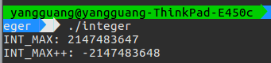
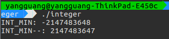
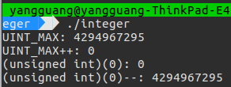
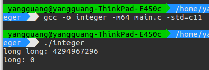
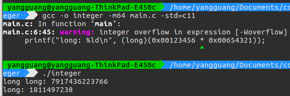
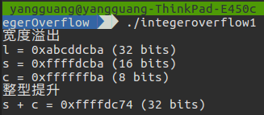
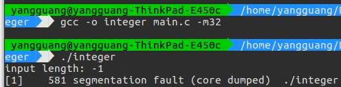
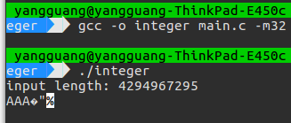

# 整数溢出

整数在内存里面保存在一个固定长度的空间内,它能存储的最大值和最小值是固定的,如果尝试去存储一个数,而这个数又大于这个固定的最大值,就会导致整数溢出

## 整数溢出的情况

### 溢出

只有有符号数才会发生溢出,有符号数的最高位表示符号,同符号数相加时,有可能改变符号位的值,产生溢出

溢出标志 OF 可以检测有符号数的溢出

* 有符号整数溢出

上溢出

```C
int i;
i = INT_MAX;  // 2 147 483 647
i++;
printf("i = %d\n", i);  // i = -2 147 483 648
```



下溢处

```C
i = INT_MIN;  // -2 147 483 648
i--;
printf("i = %d\n", i);  // i = 2 147 483 647
```



### 回绕

无符号数 0 - 1 时会变成最大的数,如 1 bytes 的无符号数会变成 255,而 255 + 1 会变成最小数 0

进位标志 CF 可检测无符号数的回绕

一个无符号整数表达式永远无法求出小于零的值


```C
#include <stdio.h>
#include <limits.h>

int main()
{
    unsigned int ui;

    ui = UINT_MAX; // 在 x86-32 上为 4 294 967 295

    printf("UINT_MAX: %u\n", ui);
    printf("UINT_MAX++: %u\n", ++ui);

    ui = 0;
    printf("(unsigned int)(0): %u\n", ui);     // ui = 0
    printf("(unsigned int)(0)--: %u\n", --ui); // 在 x86-32 上，ui = 4 294 967 295
}
```



### 截断

将一个较大宽度的数存入一个宽度小的操作数中,高位发生截断

* 加法截断

```C
printf("long long: %lld\n", (long long)(0xffffffff) + (long long)(0x00000001));
printf("long: %ld\n", (long)(0xffffffff + 0x00000001));
```



* 乘法截断

```C
printf("long long: %lld\n", (long long)(0x00123456) * (long long)(0x00654321));
printf("long: %ld\n", (long)(0x00123456 * 0x00654321));
```



### 整型溢出 宽度提升

```C
#include<stdio.h>
void main() {
    int l;
    short s;
    char c;

    l = 0xabcddcba;
    s = l;
    c = l;

    printf("宽度溢出\n");
    printf("l = 0x%x (%d bits)\n", l, sizeof(l) * 8);
    printf("s = 0x%x (%d bits)\n", s, sizeof(s) * 8);
    printf("c = 0x%x (%d bits)\n", c, sizeof(c) * 8);

    printf("整型提升\n");
    printf("s + c = 0x%x (%d bits)\n", s+c, sizeof(s+c) * 8);
}
```

计算表达式中包含了不同宽度的操作数时,较小宽度的操作数会被提升到和较大操作数一样的宽度,然后再进行计算

在整数转换的过程中，有可能导致下面的错误

* 损失值：转换为值的大小不能表示的一种类型

* 损失符号：从有符号类型转换为无符号类型，导致损失符号



## 整数溢出实例

### memcpy and strncpy

如下代码

```C
#include <stdio.h>
#include <stdlib.h>
#include <string.h>

char srcBuf[0x80];
char dstBuf[0x80];

int main()
{
    int length;
    printf("input length: ");
    scanf("%d", &length);

    if (length > 0x80)
    {
        printf("too lang\n");
        exit(-1);
    }

    memcpy(dstBuf, srcBuf, length);
}
```

如果攻击者给 length 赋于了一个负数,则可以绕过 if 语句的检测,而执行到 memcpy() 的时候,由于第三个参数是 size_t 类型,负数 len 会被转换为一个无符号整型，它可能是一个非常大的正数，从而复制了大量的内容到 buf 中,引发了缓冲区溢出



### Malloc

```C
#include <sys/types.h>
#include <sys/stat.h>
#include <fcntl.h>
#include <unistd.h>

#include <stdio.h>
#include <stdlib.h>
#include <string.h>

int main()
{
    size_t length;
    char *buf;
    char *buf2;

    int fp = open("a.avi", O_RDONLY);
    printf("input length: ");
    scanf("%u", &length);
    // printf("%u", length);

    buf = malloc(length + 5);
    buf2 = malloc(3 * sizeof(char));
    memset(buf2, 'A', 3);
    printf("%s", buf2);
    read(fp, buf, length);
    printf("%s", buf2);
}
```

如果 len 过大,len+5 有可能发生回绕

在 x86-32 上,如果 len = 0xFFFFFFFF,则 len+5 = 0x00000004,这时 malloc() 只分配了 4 字节的内存区域,然后在里面写入大量的数据,缓冲区溢出也就发生了

造成覆盖之后分配的 buf2

第二次 printf(buf2) 数据已经改变


