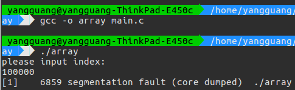
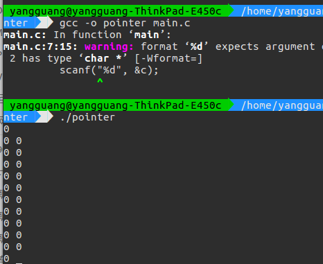
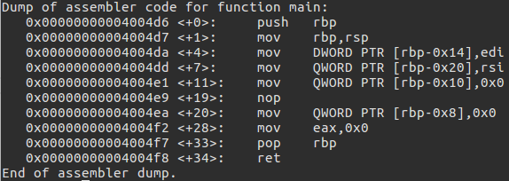
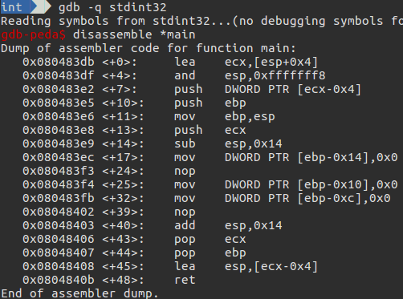

# 其它

## 数组越界

```C
#include<stdio.h>
int main(){
    int index;
    int array[3]={111,222,333};
    printf("please input index:\n");
    scanf("%d",&index);
    printf("array[%d]=%d\n",index,array[index]);
    //写越界，造成溢出；
    a[index]=233;
    return 0;
}
```

在读取时会造成数组读的越界,赋值时造成(栈)溢出

程序崩溃



## 指针混乱

```c
#include <stdio.h>

int main(){
    int i;
    char c;
    for(i=0; i<5; i++){
        scanf("%d", &c);
        printf("%d ", i);
    }
    printf("\n");
}
```

表面上,程序从标准输入设备读入5个数,在标准输出设备上写5个数

```c
0 1 2 3 4 5
```

但是结果并不一定

```c
0 0 0 0 0 1 2 3 4
```

由于 c 被声明为 char 类型,而不是 int 类型.程序 scanf 读入,传递给一个指向整数的指针. scanf 将指向字符的指针作为指向整数的指针接受.造成指向字符 c 附近的内存覆盖

可以看到如果我们一直输入 0

那么每次 i 都会被覆盖,可能永远不会到达 5

不会退出



### 返回整数的getchar函数

```c
#include <stdio.h>

main(){
    char c;

    while((c = getchar()) != EOF){
        putchar(c);
    }
}
```

getchar 等函数的返回值类型都是 int 型,当这些函数读取出错或者读完文件后,会返回 EOF . EOF 是一个宏,标准规定它的值必须是一个 int 型的负数常量.通常编译器都会把 EOF 定义为 -1.

getchar 等函数的返回值是 int 型的,当赋值给 char 型变量时,会发生降级,从而导致数据截断.

| 十进制 | int         | char  |
| :----: | :---------: | :---: |
| 10     | 00 00 00 0A | 0A    |
| -1     | FF FF FF FF | FF    |
| -2     | FF FF FF FE | FE    |

signed char 和 unsigned char 在转换成 int 后，值不同：

| char  | unsigned    | signed      |
| :---: | :---------: | :---------: |
| 10    | 00 00 00 1A | 00 00 00 1A |
| FF    | 00 00 00 FF | FF FF FF FF |
| FE    | 00 00 00 FE | FF FF FF FE |

unsigned char 造成无法退出. signed char 造成提前退出.

必须使用 int 型变量接收这些函数的返回值,然后判断接收到的值是否 EOF .只有判断发现该返回值并非 EOF ,我们才可以把该值赋值给 char 型变量.

## C语言类型

使用标准类型

```C
#include <stdint.h>
// int8_t,int16_t,int32_t,int64_t - signed integers
// uint8_t,uint16_t,uint32_t,uint64_t - unsigned integers
// float - standard 32-bit floating point
// double - standard 64-bit floating point
```

否则在不同标准和平台下,可能出现不同的字节数

```C
// gcc -std=c11 -o stdint64 main.c -m64
// gcc -std=c89 -o stdint32 main.c -m32
#include <stdint.h>

#define XXX __asm__("nop");

int main(int argc, char **argv)
{
    long number1 = 0;
    XXX;
    int64_t number_2 = 0;
}
```

x86_64 c11 情况下对应的汇编语言



x86 c89 情况下对应的汇编语言



int64_t 均为 64 位没有问题
但是 long 可以看出一个占 32(DWORD) 位,一个占 64(QWORD) 位

## signal

```c
#include <stdio.h>
#include <stdlib.h>
#include <signal.h>

#define BUFFER_SIZE 4096
static unsigned char* buffer = NULL;

void sigint_handler(){
    buffer = (unsigned char*)malloc(BUFFER_SIZE * sizeof(unsigned char));
    free(buffer);
}

int main()
{
    signal(SIGINT, sigint_handler);

    while(1){
        buffer = (unsigned char*)malloc(BUFFER_SIZE * sizeof(unsigned char));
        free(buffer);
    }

    return 0;
}
```

main 函数中的 malloc 函数的执行过程被一个信号中断.mallloc 函数用来跟踪可用内存的数据结构很可能只有部分被更新.signal 处理函数再调用malloc 函数,可能会造成 malloc 函数用到的数据结构完全崩溃.

因此,signal 处理函数的应当只打印一条出错信息.